## Sorgu 1: Kategori Bazlı "Top 3" Ürün Analizi

**İş Sorusu:** 
Her bir kategoride, bugüne kadar en çok toplam gelir (revenue) getiren ilk 3 ürün hangileridir?

**SQL Sorgusu:**
```sql
WITH ProductSales AS (
    SELECT 
        c.name AS category_name,
        p.name AS product_name,
        SUM(oi.quantity * oi.unit_price) AS total_revenue
    FROM products p
    JOIN order_items oi ON p.id = oi.product_id
    JOIN categories c ON p.category_id = c.id
    GROUP BY c.name, p.name
),
RankedProducts AS (
    SELECT 
        category_name,
        product_name,
        total_revenue,
        ROW_NUMBER() OVER(PARTITION BY category_name ORDER BY total_revenue DESC) as rank_in_category
    FROM ProductSales
)
SELECT 
    category_name,
    product_name,
    total_revenue,
    rank_in_category
FROM RankedProducts
WHERE rank_in_category <= 3;
```

**Sonuç:**
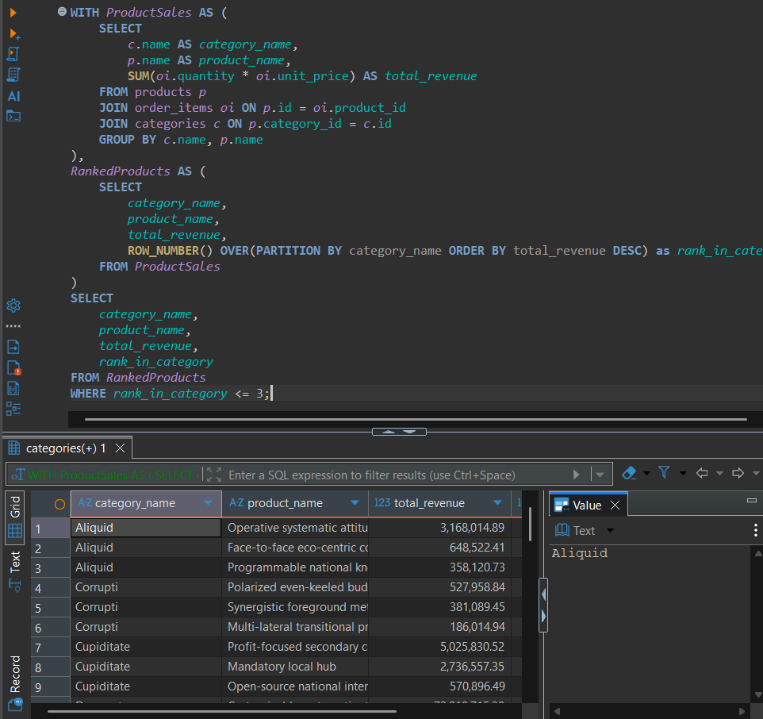

**İş Yorumu:**
Bu sorgu, pazarlama bütçesinin hangi ürünlere odaklanması gerektiğini gösteriyor. En çok gelir getiren ürünlere stok ve reklam önceliği verilmelidir.

---

## Sorgu 2: Gaps-and-Islands (Ardışık Alışveriş Serileri)

**İş Sorusu:**
Hangi kullanıcılar ardışık en az 3 gün boyunca hiç gün atlamadan alışveriş yapmıştır ve bu alışveriş serileri hangi tarihler arasındadır?

**SQL Sorgusu:**
```sql
WITH UserDates AS (
    -- Adım 1: Kullanıcıların alışveriş yaptığı benzersiz günleri bul
    SELECT DISTINCT user_id, created_at::date AS shop_date
    FROM orders
),
NumberedDates AS (
    -- Adım 2: Her kullanıcı için alışveriş tarihlerine kronolojik sıra numarası ver
    SELECT 
        user_id, 
        shop_date,
        DENSE_RANK() OVER(PARTITION BY user_id ORDER BY shop_date) as rn
    FROM UserDates
),
GroupedIslands AS (
    -- Adım 3: Sihirli Adım! Tarihten sıra numarasını çıkarıyoruz. 
    -- Eğer tarihler ardışıksa, bu çıkarma işlemi hep AYNI tarihi (Ada ID'sini) verecektir.
    SELECT 
        user_id, 
        shop_date, 
        (shop_date - rn::int) AS island_group
    FROM NumberedDates
)
-- Adım 4: Aynı adaya (island_group) düşen günleri sayıp 3 gün ve üzeri olanları getir
SELECT 
    user_id, 
    MIN(shop_date) AS streak_start, 
    MAX(shop_date) AS streak_end, 
    COUNT(*) AS streak_days
FROM GroupedIslands
GROUP BY user_id, island_group
HAVING COUNT(*) >= 3
ORDER BY streak_days DESC, user_id;
```

**Sonuç:**
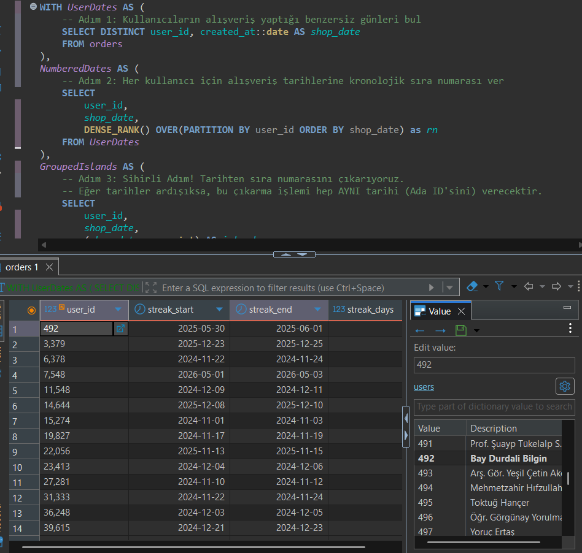

**İş Yorumu:**
Bu sorgu, platformun alışkanlık kazanmış en sadık ("streak" yapan) kullanıcılarını tespit etmemizi sağlar. Bu sadık kitleye özel VIP sadakat programları sunularak veya seriyi bozmamaları için sürpriz indirimler tanımlanarak müşteri elde tutma (retention) oranları maksimize edilebilir.

---

## Sorgu 3: 7 Günlük Hareketli Ortalama (Moving Average)

**İş Sorusu:**
Günlük satış dalgalanmalarını yumuşatarak genel büyüme/küçülme trendini görmek için, günlük gelirlerin son 7 günlük hareketli ortalaması (7-day moving average) nedir?

**SQL Sorgusu:**
```sql
WITH DailyRevenue AS (
    SELECT 
        DATE(o.created_at) AS order_date,
        SUM(oi.quantity * oi.unit_price) AS daily_total
    FROM orders o
    JOIN order_items oi ON o.id = oi.order_id
    GROUP BY DATE(o.created_at)
)
SELECT 
    order_date,
    daily_total,
    ROUND(AVG(daily_total) OVER(ORDER BY order_date ROWS BETWEEN 6 PRECEDING AND CURRENT ROW), 2) AS moving_avg_7_days
FROM DailyRevenue
ORDER BY order_date;
```

**Sonuç:**
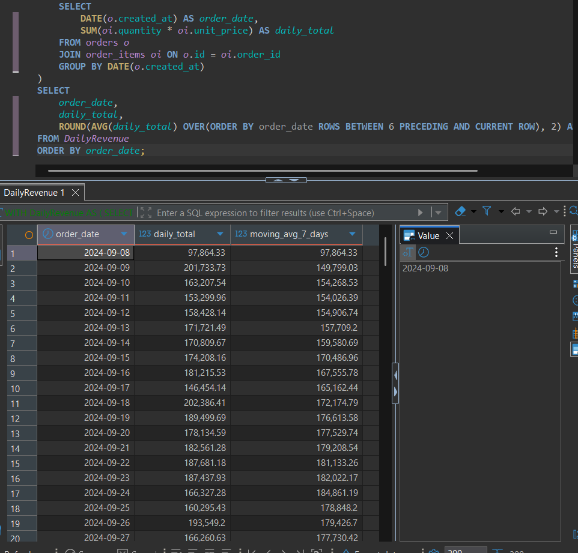

**İş Yorumu:**
Hareketli ortalama, günlük anlık düşüş veya çıkışların yarattığı "gürültüyü" filtreleyerek gerçek finansal trendi ortaya çıkarır. Bu metrik, anlık dalgalanmalardan ziyade uzun vadeli stratejiler belirlemek için yönetim panellerinde (dashboard) standart olarak izlenmelidir.

---

## Sorgu 4: Kohort Analizi (Müşteri Elde Tutma - Retention)

**İş Sorusu:**
Platforma aynı ay içinde katılan (ilk siparişini veren) kullanıcı gruplarının (kohortların), takip eden aylardaki platformda kalma ve tekrar alışveriş yapma (retention) oranları nasıldır?

**SQL Sorgusu:**
```sql
WITH UserCohorts AS (
    -- Adım 1: Her kullanıcının ilk sipariş ayını (Cohort) bul
    SELECT 
        user_id, 
        MIN(DATE_TRUNC('month', created_at)) AS cohort_month
    FROM orders
    GROUP BY user_id
),
Retention AS (
    -- Adım 2: Siparişleri Cohort aylarıyla eşleştir ve aradaki ay farkını hesapla
    SELECT 
        c.cohort_month,
        DATE_TRUNC('month', o.created_at) AS order_month,
        EXTRACT(year FROM age(DATE_TRUNC('month', o.created_at), c.cohort_month)) * 12 + 
        EXTRACT(month FROM age(DATE_TRUNC('month', o.created_at), c.cohort_month)) AS month_index,
        o.user_id
    FROM UserCohorts c
    JOIN orders o ON c.user_id = o.user_id
)
-- Adım 3: Her kohort ve ay indeksi için aktif (sipariş veren) eşsiz kullanıcıları say
SELECT 
    TO_CHAR(cohort_month, 'YYYY-MM') AS cohort,
    month_index,
    COUNT(DISTINCT user_id) AS active_customers
FROM Retention
GROUP BY cohort_month, month_index
ORDER BY cohort, month_index;
```

**Sonuç:**
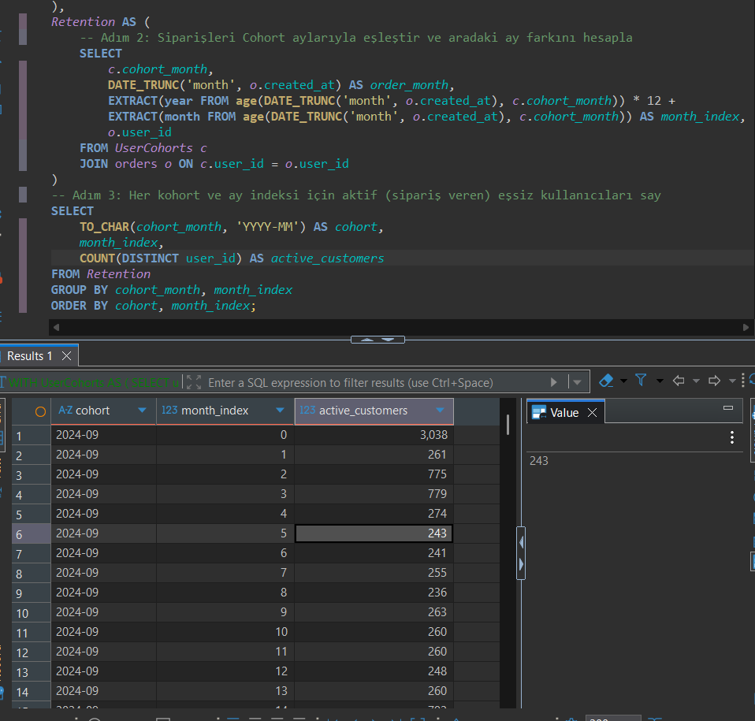

**İş Yorumu:**
Kohort analizi, platformun müşteri sadakatini ölçer. `month_index = 0` müşterinin ilk ayını temsil ederken, `month_index = 1` ve sonrasındaki aylarda sayının hızla düşmesi, müşteri deneyiminde veya yeniden pazarlama (re-marketing) stratejilerinde acil iyileştirmeler yapılması gerektiğinin sinyalidir.

---

## Sorgu 5: RFM Analizi (Müşteri Segmentasyonu)

**İş Sorusu:**
Platformdaki müşterilerin alışveriş alışkanlıklarını anlamak için; en son ne zaman alışveriş yaptıkları (Recency), ne sıklıkla alışveriş yaptıkları (Frequency) ve toplam ne kadar harcadıklarına (Monetary) göre 1 ile 4 arasında nasıl skorlanabilirler?

**SQL Sorgusu:**
```sql
WITH UserStats AS (
    -- Adım 1: Her kullanıcının son sipariş tarihini, toplam sipariş sayısını ve harcamasını bul
    SELECT 
        o.user_id,
        MAX(o.created_at) AS last_order_date,
        COUNT(DISTINCT o.id) AS frequency,
        SUM(oi.quantity * oi.unit_price) AS monetary
    FROM orders o
    JOIN order_items oi ON o.id = oi.order_id
    GROUP BY o.user_id
),
MaxDate AS (
    -- Adım 2: Veritabanındaki en güncel sipariş tarihini "bugün" olarak kabul et
    SELECT MAX(last_order_date) AS db_max_date FROM UserStats
),
RFM_Base AS (
    -- Adım 3: En son siparişten bu yana geçen gün sayısını (Recency) hesapla
    SELECT 
        u.user_id,
        EXTRACT(DAY FROM (m.db_max_date - u.last_order_date)) AS recency_days,
        u.frequency,
        u.monetary
    FROM UserStats u
    CROSS JOIN MaxDate m
)
-- Adım 4: Kullanıcıları NTILE(4) ile 4 eşit gruba bölerek 1-4 arası puanla
SELECT 
    user_id,
    recency_days,
    frequency,
    monetary,
    NTILE(4) OVER(ORDER BY recency_days ASC) AS r_score,
    NTILE(4) OVER(ORDER BY frequency DESC) AS f_score,
    NTILE(4) OVER(ORDER BY monetary DESC) AS m_score
FROM RFM_Base
ORDER BY m_score DESC, f_score DESC;
```

**Sonuç:**
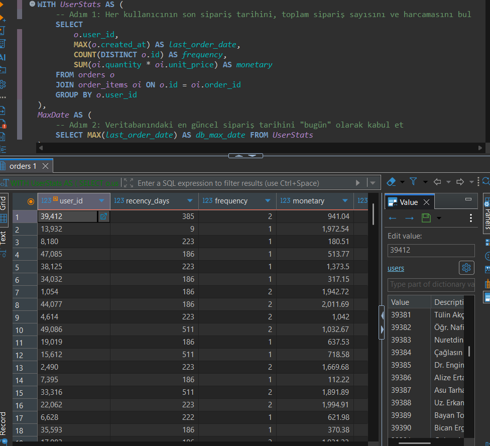

**İş Yorumu:**
RFM analizi, pazarlama stratejilerinin temelini oluşturur. R, F ve M skorları 4 olan (en yüksek skorlu) müşteriler markanın sadık VIP kitlesidir ve özel hissettirilmelidir. R skoru düşük (çoktandır alışveriş yapmayan) ama M skoru yüksek müşteriler ise "geri kazanılması gereken yüksek değerli" kullanıcılardır ve onlara özel hatırlatıcı indirim kuponları gönderilmelidir.

---

## Sorgu 6: Pareto Analizi (Gelirin %80'ini Getiren Ürünler)

**İş Sorusu:**
Platformdaki toplam gelirin büyük kısmını oluşturan "Yıldız Ürünleri" tespit etmek için, kümülatif olarak (running total) toplam gelirin %80'ini sağlayan en değerli ürünler hangileridir?

**SQL Sorgusu:**
```sql
WITH ProductSales AS (
    -- Adım 1: Her ürünün getirdiği toplam geliri bul
    SELECT 
        p.name AS product_name, 
        SUM(oi.quantity * oi.unit_price) AS product_revenue
    FROM products p
    JOIN order_items oi ON p.id = oi.product_id
    GROUP BY p.id, p.name
),
TotalSales AS (
    -- Adım 2: Platformun bugüne kadarki tüm gelirini hesapla
    SELECT SUM(product_revenue) AS total_platform_revenue FROM ProductSales
),
RunningTotal AS (
    -- Adım 3: Ürünleri en çok kazandırandan en aza doğru sıralayıp kümülatif toplam al
    SELECT 
        p.product_name, 
        p.product_revenue,
        SUM(p.product_revenue) OVER(ORDER BY p.product_revenue DESC) AS running_revenue,
        t.total_platform_revenue
    FROM ProductSales p
    CROSS JOIN TotalSales t
)
-- Adım 4: Sadece kümülatif geliri, toplam gelirin %80'ine ulaşana kadar olan ürünleri getir
SELECT 
    product_name,
    product_revenue,
    running_revenue,
    ROUND((running_revenue / total_platform_revenue) * 100, 2) AS cumulative_percentage
FROM RunningTotal
WHERE (running_revenue - product_revenue) / total_platform_revenue <= 0.80
ORDER BY product_revenue DESC;
```

**Sonuç:**
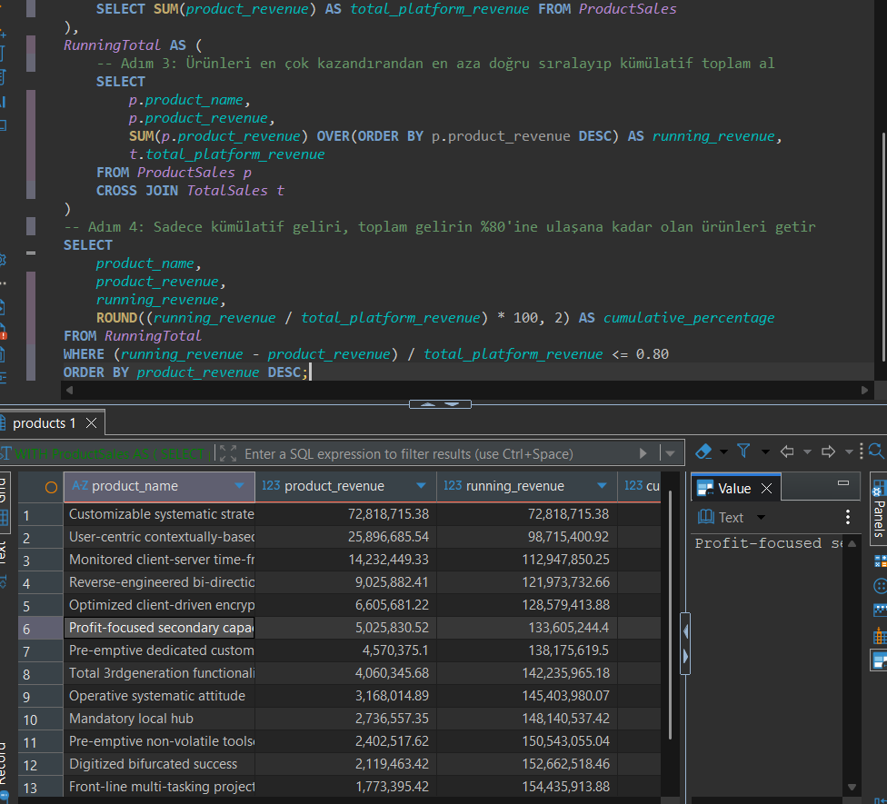

**İş Yorumu:**
Pareto analizi sonucunda listelenen bu ürünler, e-ticaret operasyonumuzun omurgasıdır (A-Sınıfı ürünler). Lojistik biriminin bu ürünlerde asla stok sorunu yaşamaması (out-of-stock) gerekir ve pazarlama bütçesinin aslan payı bu ürünlerin reklamlarına ayrılmalıdır.

---

## Sorgu 7: Aylık Sepet Ortalaması (AOV - Average Order Value) Trendi

**İş Sorusu:**
Zaman içinde müşterilerin tek bir siparişte ortalama ne kadar harcadığını (Sepet Ortalaması) ve aylara göre sepet büyüklüğü trendini nasıl gözlemleyebiliriz?

**SQL Sorgusu:**
```sql
WITH OrderTotals AS (
    -- Adım 1: Her bir siparişin (sepetin) toplam tutarını hesapla
    SELECT 
        o.id AS order_id,
        DATE_TRUNC('month', o.created_at) AS order_month,
        SUM(oi.quantity * oi.unit_price) AS order_total
    FROM orders o
    JOIN order_items oi ON o.id = oi.order_id
    GROUP BY o.id, DATE_TRUNC('month', o.created_at)
)
-- Adım 2: Aylara göre toplam sipariş sayısını ve sepet ortalamasını (AVG) bul
SELECT 
    TO_CHAR(order_month, 'YYYY-MM') AS month,
    COUNT(order_id) AS total_orders,
    ROUND(AVG(order_total), 2) AS average_order_value,
    ROUND(MAX(order_total), 2) AS max_order_value
FROM OrderTotals
GROUP BY order_month
ORDER BY month;
```

**Sonuç:**
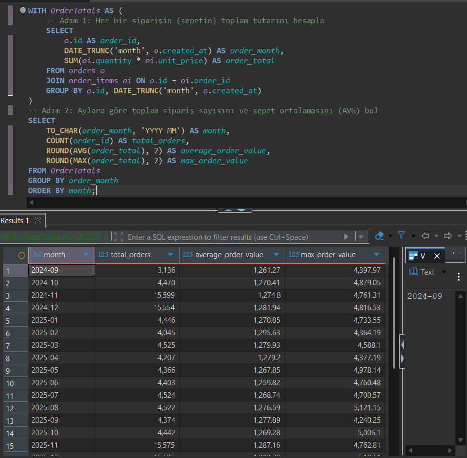

**İş Yorumu:**
Sepet ortalamasının (AOV) aylara göre düzenli artış göstermesi, uygulanan "çapraz satış" (cross-sell) ve "üst satış" (up-sell) stratejilerinin başarılı olduğunu gösterir. AOV'nin düştüğü aylar tespit edilip, sepet tutarını artıracak "X TL üzeri kargo bedava" veya "3 Al 2 Öde" gibi promosyonlar kurgulanmalıdır.

---

## Sorgu 8: Müşteri Dönüşüm Hunisi (Funnel Analysis)

**İş Sorusu:**
Platformdan alışveriş yapan müşterilerin yüzde kaçı "tek seferlik müşteri" olmaktan çıkıp "tekrar eden müşteri"ye dönüşüyor ve yüzde kaçı tüm platformu keşfedip en az 5 farklı kategoriden alışveriş yapan "çok yönlü/sadık müşteri" seviyesine ulaşıyor?

**SQL Sorgusu:**
```sql
WITH FunnelBase AS (
    -- Adım 1: Huni Başı - Platformdan en az 1 kez sipariş veren tüm tekil kullanıcılar
    SELECT COUNT(DISTINCT user_id) as step1_users FROM orders
),
Step2 AS (
    -- Adım 2: Huni Ortası - Birden fazla sipariş veren kullanıcılar (Tekrar eden müşteriler)
    SELECT COUNT(*) as step2_users
    FROM (
        SELECT user_id FROM orders GROUP BY user_id HAVING COUNT(id) > 1
    ) t
),
Step3 AS (
    -- Adım 3: Huni Sonu - En az 5 farklı kategoriden alışveriş yapan sadık/çok yönlü müşteriler
    SELECT COUNT(*) as step3_users
    FROM (
        SELECT o.user_id
        FROM orders o
        JOIN order_items oi ON o.id = oi.order_id
        JOIN products p ON oi.product_id = p.id
        GROUP BY o.user_id
        HAVING COUNT(DISTINCT p.category_id) >= 5
    ) t
)
-- Adım 4: Huniyi oluştur ve ilk adıma göre dönüşüm (conversion) oranlarını hesapla
SELECT 
    '1. En Az 1 Sipariş Veren Müşteriler' AS funnel_stage,
    step1_users AS user_count,
    100.00 AS conversion_rate_percent
FROM FunnelBase

UNION ALL

SELECT 
    '2. Tekrar Eden (2+ Sipariş) Müşteriler',
    (SELECT step2_users FROM Step2),
    ROUND((SELECT step2_users FROM Step2)::numeric / (SELECT step1_users FROM FunnelBase) * 100, 2)
FROM FunnelBase

UNION ALL

SELECT 
    '3. Sadık Müşteriler (5+ Kategori Keşfedenler)',
    (SELECT step3_users FROM Step3),
    ROUND((SELECT step3_users FROM Step3)::numeric / (SELECT step1_users FROM FunnelBase) * 100, 2)
FROM FunnelBase;
```

**Sonuç:**
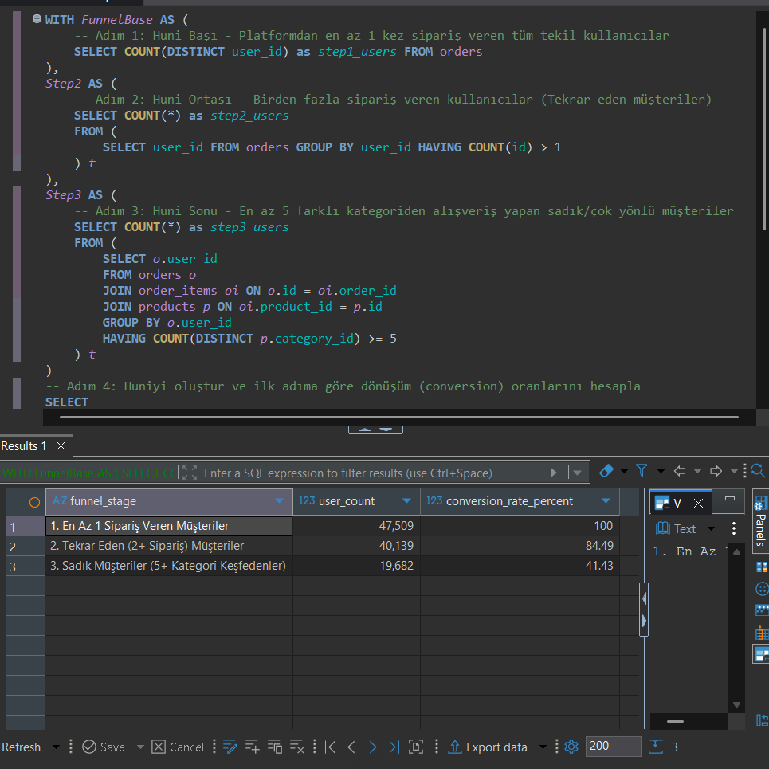

**İş Yorumu:**
Dönüşüm hunisi, kullanıcı yolculuğundaki dar boğazları (bottleneck) tespit etmemizi sağlar. 1. adımdan 2. adıma geçerken yaşanan keskin düşüşler, müşterinin ilk sipariş deneyiminden memnun kalmadığını (kötü paketleme, yavaş kargo vb.) veya "ikinci alışverişe özel indirim" gibi teşvik edici kampanyaların eksik olduğunu gösterir.

---

## Sorgu 9: Aydan Aya Büyüme Oranı (MoM - Month over Month Growth)

**İş Sorusu:**
Platformun aylık gelir trendi nasıldır ve her ay bir önceki aya göre yüzde kaç büyüme (veya küçülme) kaydedilmiştir?

**SQL Sorgusu:**
```sql
WITH MonthlyRevenue AS (
    -- Adım 1: Her ayın toplam gelirini hesapla
    SELECT 
        DATE_TRUNC('month', o.created_at) AS order_month,
        SUM(oi.quantity * oi.unit_price) AS revenue
    FROM orders o
    JOIN order_items oi ON o.id = oi.order_id
    GROUP BY DATE_TRUNC('month', o.created_at)
),
RevenueGrowth AS (
    -- Adım 2: LAG() fonksiyonu ile bir önceki ayın gelirini aynı satıra getir
    SELECT 
        order_month,
        revenue,
        LAG(revenue) OVER(ORDER BY order_month) AS previous_month_revenue
    FROM MonthlyRevenue
)
-- Adım 3: Büyüme/Küçülme yüzdesini hesapla
SELECT 
    TO_CHAR(order_month, 'YYYY-MM') AS month,
    ROUND(revenue, 2) AS current_revenue,
    ROUND(previous_month_revenue, 2) AS prev_revenue,
    ROUND(((revenue - previous_month_revenue) / previous_month_revenue) * 100, 2) AS growth_percentage
FROM RevenueGrowth
ORDER BY month;
```

**Sonuç:**
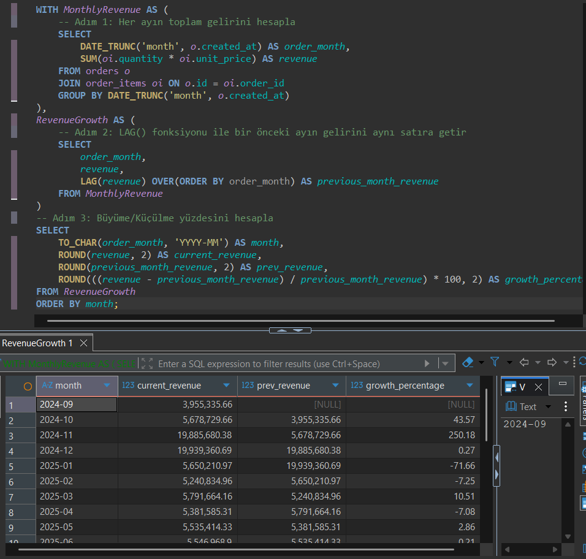

**İş Yorumu:**
Aydan aya büyüme (MoM) metrikleri, şirketin ivmesini (momentum) gösterir. Büyüme yüzdesinin negatif (`-`) olduğu aylar, sezonsal düşüşleri (örneğin yaz ayları rehaveti) veya başarısız geçen pazarlama kampanyalarını işaret eder. Sürekli pozitif bir `growth_percentage` ise yatırımcı sunumlarında aranan en temel grafiktir.

---

## Sorgu 10: Sepet (Birliktelik) Analizi - Birlikte Alınan Kategoriler

**İş Sorusu:**
Sepet ortalamasını (AOV) artırmak için kullanacağımız "Birlikte Al" kampanyalarını belirlemek amacıyla; müşteriler en çok hangi iki ürün kategorisini aynı siparişte (aynı sepette) birlikte satın alıyor?

**SQL Sorgusu:**
```sql
WITH BasketItems AS (
    -- Adım 1: Her bir siparişin içindeki ürünlerin kategorilerini listele
    SELECT 
        oi.order_id,
        c.name AS category_name
    FROM order_items oi
    JOIN products p ON oi.product_id = p.id
    JOIN categories c ON p.category_id = c.id
)
-- Adım 2: Aynı sepeti (order_id) paylaşan ama farklı isimlere sahip kategorileri eşleştir
SELECT 
    b1.category_name AS category_a,
    b2.category_name AS category_b,
    COUNT(*) AS times_bought_together
FROM BasketItems b1
JOIN BasketItems b2 ON b1.order_id = b2.order_id 
    AND b1.category_name < b2.category_name -- A-B ve B-A tekrarlarını önlemek için hile
GROUP BY b1.category_name, b2.category_name
ORDER BY times_bought_together DESC
LIMIT 10;
```

**Sonuç:**
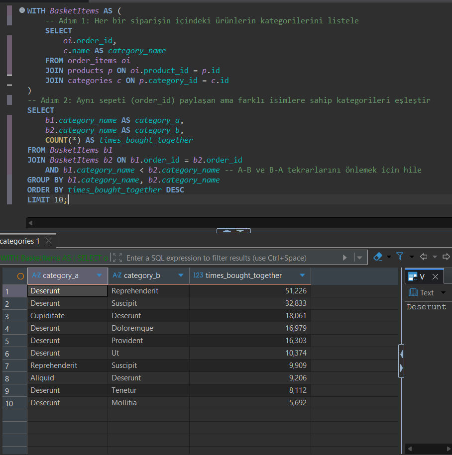

**İş Yorumu:**
Sepet analizi, e-ticaretin tavsiye (recommendation) sistemlerini besler. Bu sorgu sonucunda en çok birlikte satılan Kategori A ve Kategori B tespit edilerek, ürün detay sayfalarında "Birlikte Alın, %10 İndirim Kazanın" şeklinde paket (bundle) kampanyaları kurgulanmalı ve stok yerleşimleri depoda birbirine yakın konumlandırılmalıdır.

---

## Sorgu 11: En Değerli Müşteriler (LTV - Lifetime Value)

**İş Sorusu:**
Platformumuza bugüne kadar en çok sipariş veren ve toplamda en fazla gelir bırakan (Müşteri Yaşam Boyu Değeri en yüksek) ilk 5 VIP müşterimiz kimlerdir?

**SQL Sorgusu:**
```sql
SELECT 
    u.name AS customer_name,
    COUNT(DISTINCT o.id) AS total_orders,
    SUM(oi.quantity * oi.unit_price) AS lifetime_value
FROM users u
JOIN orders o ON u.id = o.user_id
JOIN order_items oi ON o.id = oi.order_id
GROUP BY u.id, u.name
ORDER BY lifetime_value DESC
LIMIT 5;
```

**Sonuç:**
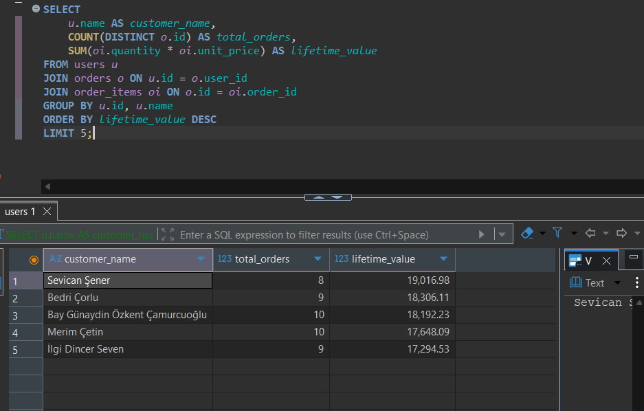

**İş Yorumu:**
LTV (Lifetime Value) metriği, pazarlama bütçesinin sınırlarını belirler. En çok gelir getiren bu VIP müşteriler tespit edilerek onlara özel "Premium Müşteri Temsilcisi" atanabilir ve doğum günlerinde sepet tutarına bakılmaksızın lüks hediyeler gönderilerek marka sadakati kalıcı hale getirilebilir.

---

## Sorgu 12: Günün Saatlerine Göre Satış Yoğunluğu (Peak Hours)

**İş Sorusu:**
Platformumuzda günün hangi saatlerinde sipariş yoğunluğu tavan yapmaktadır (Peak Hours) ve bu saatlerdeki toplam gelir dağılımı nasıldır?

**SQL Sorgusu:**
```sql
SELECT 
    EXTRACT(HOUR FROM o.created_at) AS hour_of_day,
    COUNT(DISTINCT o.id) AS total_orders,
    SUM(oi.quantity * oi.unit_price) AS hourly_revenue
FROM orders o
JOIN order_items oi ON o.id = oi.order_id
GROUP BY EXTRACT(HOUR FROM o.created_at)
ORDER BY hour_of_day;
```

**Sonuç:**
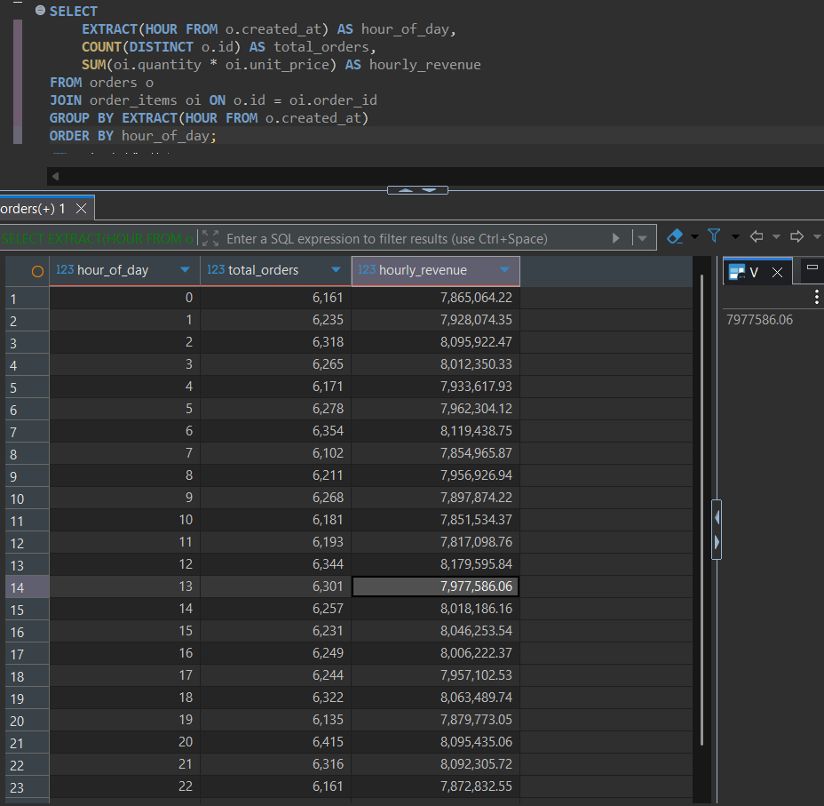

**İş Yorumu:**
Saatlik satış yoğunluğu haritası (Heatmap), sunucu ve veritabanı yük testlerinin (load testing) hangi saatlerde yapılması gerektiğini gösterir. Ayrıca müşteri hizmetleri vardiya planlaması ve "Flash İndirim" (Flash Sales) push bildirimleri tam olarak bu yoğun saatlere göre ayarlanmalıdır.

---

## Sorgu 13: Kategori Bazında Fiyat ve Marj Analizi

**İş Sorusu:**
Her bir kategorideki ürün sayımız, ortalama ürün fiyatımız ve o kategorideki en pahalı ile en ucuz ürün arasındaki makas (fiyat aralığı) nedir?

**SQL Sorgusu:**
```sql
SELECT 
    c.name AS category_name,
    COUNT(p.id) AS total_products,
    ROUND(AVG(p.price), 2) AS average_price,
    MAX(p.price) AS most_expensive_item,
    MIN(p.price) AS cheapest_item
FROM categories c
JOIN products p ON c.id = p.category_id
GROUP BY c.name
ORDER BY average_price DESC;
```

**Sonuç:**
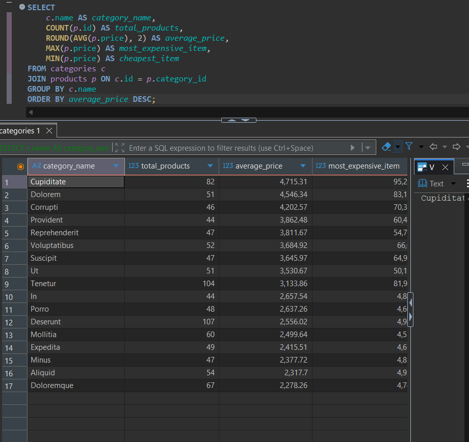

**İş Yorumu:**
Kategoriler arası fiyat makasını görmek, platformun hangi gelir grubuna hitap ettiğini netleştirir. Ortalama fiyatı çok düşük ama ürün adedi çok yüksek olan kategorilerde kargo maliyetlerini düşürecek lojistik anlaşmalar yapılmalıdır.

---

## Sorgu 14: Aylık Yeni Müşteri Kazanımı (Acquisition)

**İş Sorusu:**
Zaman çizelgesine göre, platformumuz her ay ilk siparişini veren (sisteme yeni kazandırılan) kaç taze müşteri edinmektedir?

**SQL Sorgusu:**
```sql
WITH FirstOrders AS (
    SELECT 
        user_id, 
        MIN(created_at) AS first_order_date
    FROM orders
    GROUP BY user_id
)
SELECT 
    TO_CHAR(first_order_date, 'YYYY-MM') AS acquisition_month,
    COUNT(user_id) AS new_customers
FROM FirstOrders
GROUP BY TO_CHAR(first_order_date, 'YYYY-MM')
ORDER BY acquisition_month;
```

**Sonuç:**
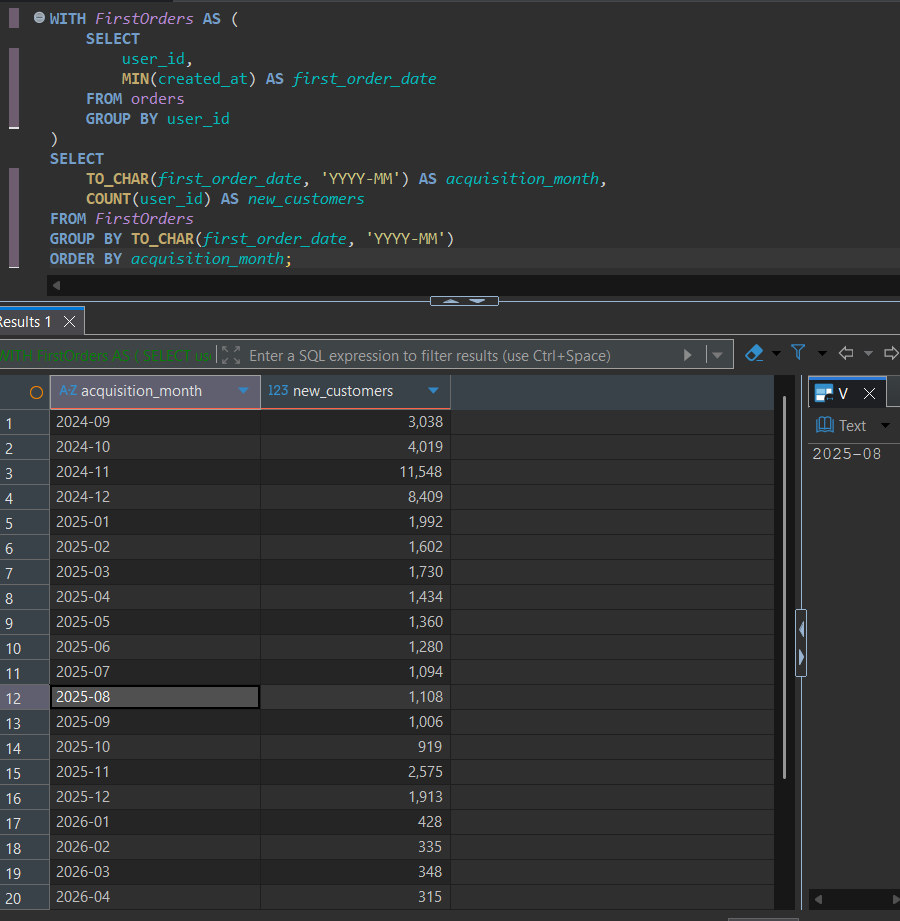

**İş Yorumu:**
Yeni müşteri kazanım hızı (Customer Acquisition), büyümenin en net göstergesidir. Sayıların aniden sıçradığı aylar, geçmiş pazarlama kampanyalarının (Influencer işbirlikleri, TV reklamları vb.) verimlilik (ROI) analizinde referans noktası olarak kullanılır.

---

## Sorgu 15: Sepet Büyüklüğü Segmentasyonu (Order Size Buckets)

**İş Sorusu:**
Müşteriler sipariş verirken genelde tek bir ürün mü alıyorlar, yoksa 5-10 ürünlük büyük sepetler mi yapıyorlar? Siparişlerin içindeki toplam eşya sayısına göre dağılım nasıldır?

**SQL Sorgusu:**
```sql
WITH OrderSizes AS (
    SELECT 
        order_id, 
        SUM(quantity) AS total_items
    FROM order_items
    GROUP BY order_id
)
SELECT 
    CASE 
        WHEN total_items = 1 THEN '1. Tekli Ürün (1)'
        WHEN total_items BETWEEN 2 AND 4 THEN '2. Küçük Sepet (2-4)'
        WHEN total_items BETWEEN 5 AND 9 THEN '3. Orta Sepet (5-9)'
        ELSE '4. Büyük Sepet (10+)'
    END AS basket_size_segment,
    COUNT(order_id) AS order_count
FROM OrderSizes
GROUP BY basket_size_segment
ORDER BY basket_size_segment;
```

**Sonuç:**
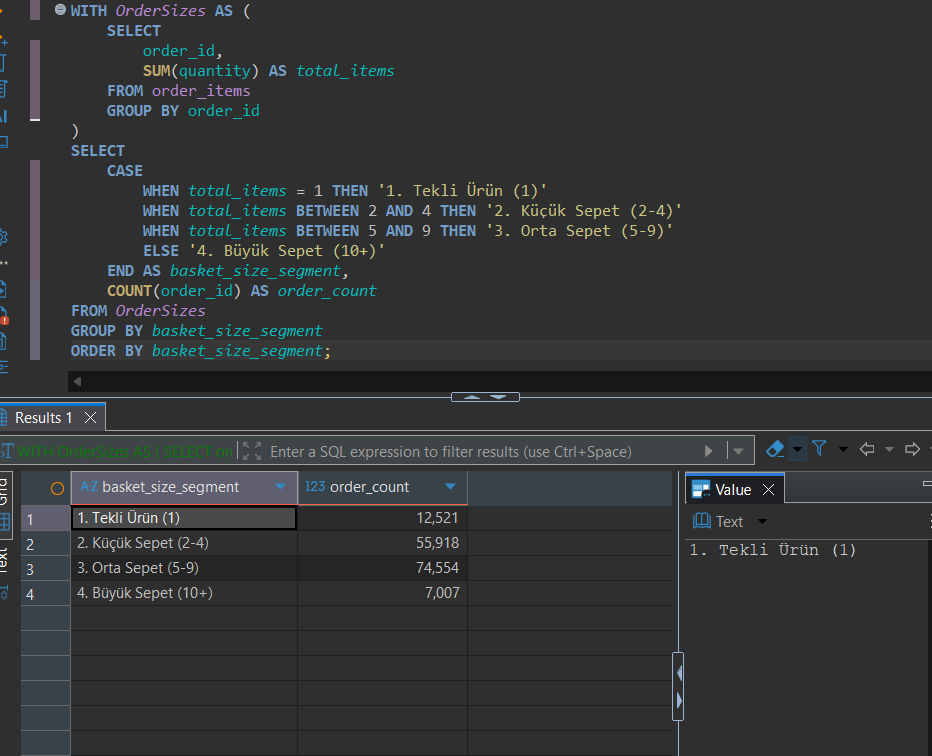

**İş Yorumu:**
Müşterilerin büyük çoğunluğu "Tekli Ürün" segmentindeyse, kargo maliyetleri şirket için büyük bir yük oluşturuyor demektir. Bunu kırmak için "Sepetteki 2. ürüne %50 indirim" gibi hacmi artırmaya yönelik acil aksiyonlar alınmalıdır.

---

## Sorgu 16: En Çok Satılan 5 Ürün (Hacim Bazlı Bestseller)

**İş Sorusu:**
Gelirden ziyade adet (hacim) bazında platformumuzda en çok satılan, deponun en hareketli 5 ürünü hangileridir?

**SQL Sorgusu:**
```sql
SELECT 
    p.name AS product_name, 
    SUM(oi.quantity) AS total_units_sold
FROM products p
JOIN order_items oi ON p.id = oi.product_id
GROUP BY p.id, p.name
ORDER BY total_units_sold DESC
LIMIT 5;
```

**Sonuç:**
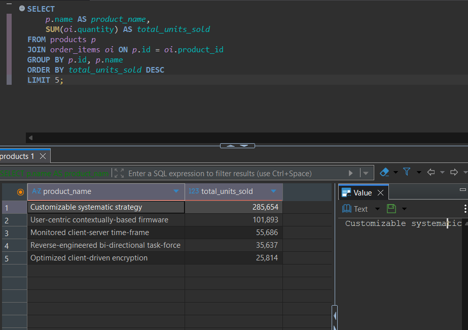

**İş Yorumu:**
Adet bazında en çok satan bu ürünler platformun "çekici gücü"dür. Çoğu müşteri sadece bu ürünleri almak için siteye girer. Bu ürünlerin stoğunun hiçbir zaman tükenmemesi (out-of-stock) lojistik biriminin bir numaralı kuralıdır.

---

## Sorgu 17: Hafta İçi ve Hafta Sonu Gelir Karşılaştırması

**İş Sorusu:**
Müşterilerimizin alışveriş alışkanlıkları hafta içine mi yoksa hafta sonuna mı daha fazla yoğunlaşıyor?

**SQL Sorgusu:**
```sql
SELECT 
    CASE 
        WHEN EXTRACT(ISODOW FROM o.created_at) IN (6, 7) THEN 'Hafta Sonu'
        ELSE 'Hafta İçi'
    END AS day_type,
    COUNT(DISTINCT o.id) AS order_count,
    ROUND(SUM(oi.quantity * oi.unit_price), 2) AS total_revenue
FROM orders o
JOIN order_items oi ON o.id = oi.order_id
GROUP BY 
    CASE 
        WHEN EXTRACT(ISODOW FROM o.created_at) IN (6, 7) THEN 'Hafta Sonu'
        ELSE 'Hafta İçi'
    END
ORDER BY total_revenue DESC;
```

**Sonuç:**
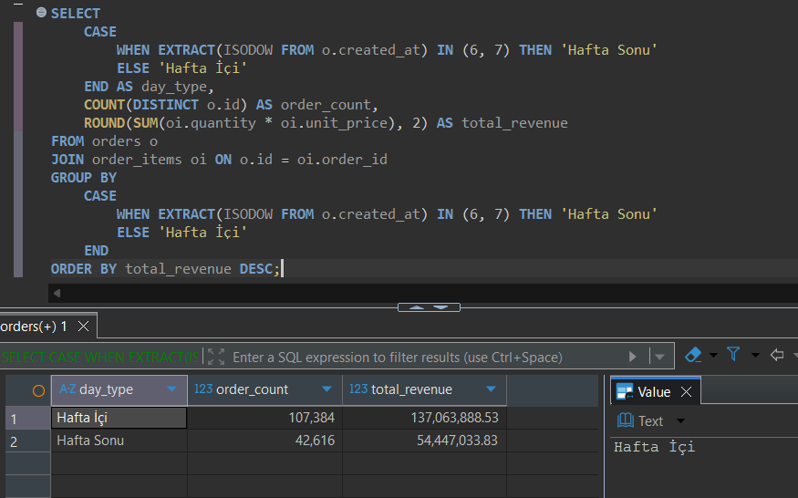

**İş Yorumu:**
Bütçe optimizasyonu için çok önemlidir. Eğer gelirlerin büyük kısmı hafta sonundan geliyorsa, dijital pazarlama bütçesi (Google/Meta Ads) Cuma akşamı ile Pazar gecesi aralığına yoğunlaştırılmalı, hafta içi harcamaları kısılmalıdır.

---

## Sorgu 18: Müşteri Sipariş Sıklığı Dağılımı

**İş Sorusu:**
Sadece 1 kez sipariş veren kaç müşterimiz var, 2 kez veren kaç müşterimiz var? Sipariş sıklığına göre müşteri havuzumuzun dağılımı nasıldır?

**SQL Sorgusu:**
```sql
WITH UserOrders AS (
    SELECT user_id, COUNT(id) AS order_count
    FROM orders
    GROUP BY user_id
)
SELECT 
    order_count AS number_of_orders_made, 
    COUNT(user_id) AS number_of_customers
FROM UserOrders
GROUP BY order_count
ORDER BY order_count;
```

**Sonuç:**
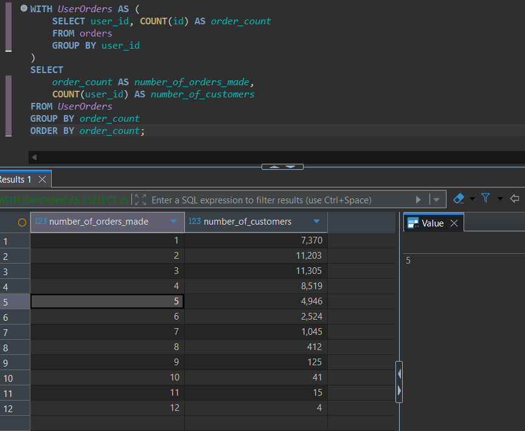

**İş Yorumu:**
Eğer "1 kez sipariş veren" (One-time buyer) müşteri sayısı aşırı yüksekse, platform müşteri tutma (retention) konusunda başarısız demektir. İlk alışverişini yapanlara mutlaka "2. Siparişinde Geçerli %20 İndirim" kuponu gönderilmelidir.

---

## Sorgu 19: ABC Müşteri Segmentasyonu (Harcama Sınıfları)

**İş Sorusu:**
Toplam harcamalarına göre müşterilerimizi "VIP", "Orta" ve "Düşük" değerli olarak sınıflandırdığımızda, hangi segmentte kaç müşterimiz bulunuyor?

**SQL Sorgusu:**
```sql
WITH UserSpending AS (
    SELECT 
        o.user_id, 
        SUM(oi.quantity * oi.unit_price) AS total_spent
    FROM orders o
    JOIN order_items oi ON o.id = oi.order_id
    GROUP BY o.user_id
)
SELECT 
    CASE 
        WHEN total_spent > 5000 THEN 'A-Sınıfı (VIP, 5000+ TL)'
        WHEN total_spent BETWEEN 1000 AND 5000 THEN 'B-Sınıfı (Orta, 1000-5000 TL)'
        ELSE 'C-Sınıfı (Düşük, <1000 TL)'
    END AS customer_segment,
    COUNT(user_id) AS customer_count
FROM UserSpending
GROUP BY 
    CASE 
        WHEN total_spent > 5000 THEN 'A-Sınıfı (VIP, 5000+ TL)'
        WHEN total_spent BETWEEN 1000 AND 5000 THEN 'B-Sınıfı (Orta, 1000-5000 TL)'
        ELSE 'C-Sınıfı (Düşük, <1000 TL)'
    END
ORDER BY customer_segment;
```

**Sonuç:**
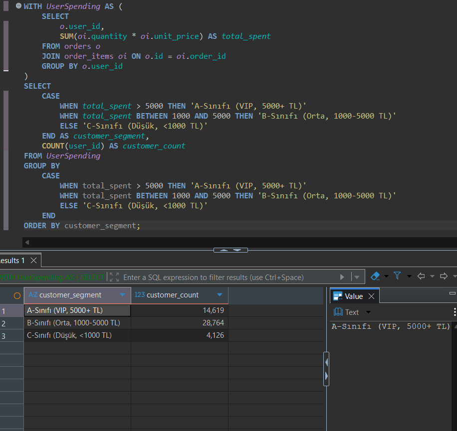

**İş Yorumu:**
ABC analizi kaynak yönetimini belirler. Müşteri hizmetleri departmanında A-Sınıfı müşterilere telefonla öncelik hakkı (VIP Line) tanınmalı, C-Sınıfı müşteriler ise chatbot veya SSS (Sıkça Sorulan Sorular) sayfalarına yönlendirilmelidir.

---

## Sorgu 20: Yeni Müşterilerin "İlk Sipariş" Kategori Tercihleri

**İş Sorusu:**
Platformumuza yeni katılan müşteriler, ilk siparişlerinde en çok hangi ürün kategorisini tercih ederek sisteme giriş yapıyorlar?

**SQL Sorgusu:**
```sql
WITH RankedOrders AS (
    SELECT 
        o.id AS order_id,
        ROW_NUMBER() OVER(PARTITION BY o.user_id ORDER BY o.created_at) as rn
    FROM orders o
)
SELECT 
    c.name AS first_purchase_category,
    COUNT(DISTINCT ro.order_id) AS total_first_orders
FROM RankedOrders ro
JOIN order_items oi ON ro.order_id = oi.order_id
JOIN products p ON oi.product_id = p.id
JOIN categories c ON p.category_id = c.id
WHERE ro.rn = 1
GROUP BY c.name
ORDER BY total_first_orders DESC
LIMIT 5;
```

**Sonuç:**
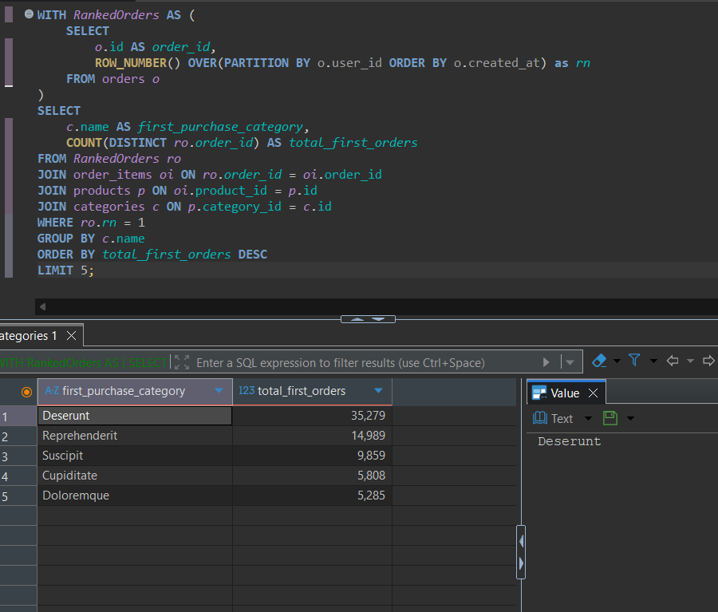

**İş Yorumu:**
Yeni kullanıcıların platformu "denemek" için en çok tercih ettiği bu "giriş kategorileri", dışa dönük reklamlarda (sosyal medya afişleri vb.) bir kanca (hook) olarak kullanılmalıdır.

---

## Sorgu 21: "Hayalet" (Pasif) Müşteri Oranı 

**İş Sorusu:**
Platformumuza kayıt olmuş ancak bugüne kadar hiç sipariş vermemiş (pasif/hayalet) kullanıcıların toplam müşteri havuzumuza oranı nedir?

**SQL Sorgusu:**
```sql
WITH UserStats AS (
    SELECT 
        u.id, 
        COUNT(o.id) AS order_count 
    FROM users u 
    LEFT JOIN orders o ON u.id = o.user_id 
    GROUP BY u.id
)
SELECT 
    COUNT(*) AS total_registered_users,
    SUM(CASE WHEN order_count = 0 THEN 1 ELSE 0 END) AS ghost_users,
    ROUND((SUM(CASE WHEN order_count = 0 THEN 1 ELSE 0 END)::numeric / COUNT(*)) * 100, 2) AS ghost_percentage
FROM UserStats;
```

**Sonuç:**
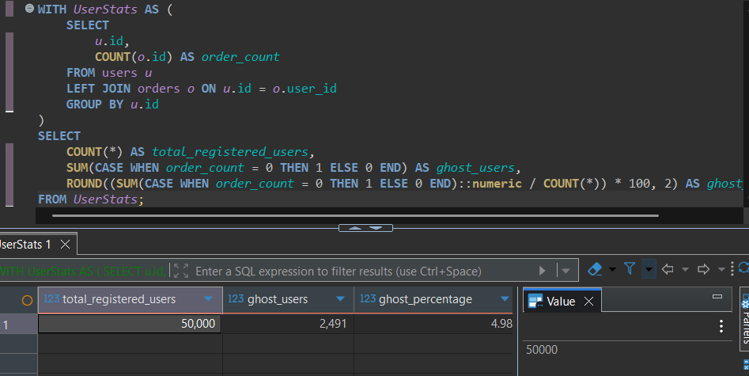

**İş Yorumu:**
Hayalet müşteri (`ghost_percentage`) oranının yüksek olması, kayıt sürecinin başarılı olduğunu ancak "İlk Alışverişe İkna" (Onboarding) aşamasında başarısız olunduğunu gösterir. Bu kitleye SMS veya e-posta yoluyla "İlk Siparişe Özel Hosgeldin İndirimi" atılarak uyuyan veri uyandırılmalıdır.

---

## Sorgu 22: Haftanın Günlerine Göre Performans Dağılımı

**İş Sorusu:**
Haftanın hangi günleri platformumuzda en çok sipariş veriliyor ve hangi günler en yüksek geliri elde ediyoruz?

**SQL Sorgusu:**
```sql
SELECT 
    TO_CHAR(o.created_at, 'Day') AS day_of_week,
    EXTRACT(ISODOW FROM o.created_at) AS day_index,
    COUNT(DISTINCT o.id) AS total_orders,
    SUM(oi.quantity * oi.unit_price) AS total_revenue
FROM orders o
JOIN order_items oi ON o.id = oi.order_id
GROUP BY TO_CHAR(o.created_at, 'Day'), EXTRACT(ISODOW FROM o.created_at)
ORDER BY day_index;
```

**Sonuç:**
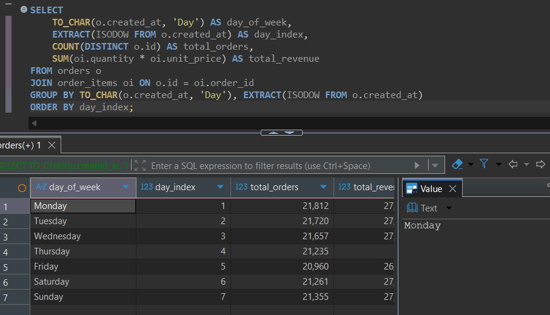

**İş Yorumu:**
Günlük satış dağılımı, "Günün Fırsatı" (Deal of the Day) tarzı kampanyaların planlanmasında kullanılır. Satışların ve trafiğin en düşük olduğu günlerde (örneğin Çarşamba), platforma yapay bir hareketlilik getirmek için agresif "Sadece Bugüne Özel" flaş indirimler düzenlenmelidir.

---

## Sorgu 23: Kategori Hacmi ve Karlılık Analizi

**İş Sorusu:**
Her bir ürün kategorisinin getirdiği toplam sipariş adedi, satılan eşya hacmi ve toplam gelir sıralaması nasıldır?

**SQL Sorgusu:**
```sql
SELECT 
    c.name AS category_name,
    COUNT(DISTINCT oi.order_id) AS total_orders,
    SUM(oi.quantity) AS total_items_sold,
    SUM(oi.quantity * oi.unit_price) AS total_revenue
FROM categories c
JOIN products p ON c.id = p.category_id
JOIN order_items oi ON p.id = oi.product_id
GROUP BY c.name
ORDER BY total_revenue DESC;
```

**Sonuç:**
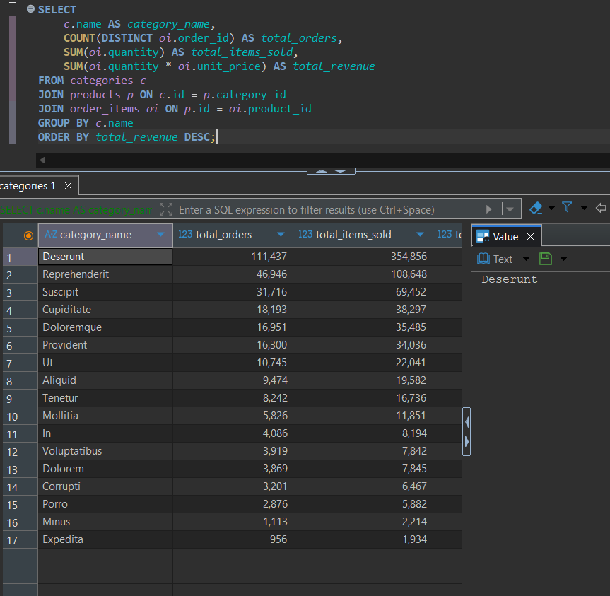

**İş Yorumu:**
Bir kategorinin sipariş adedi (`total_orders`) yüksek ama bıraktığı gelir (`total_revenue`) düşükse, o kategoride birim fiyatı çok ucuz ürünler satılıyor demektir. İşletme enerjisini, hem hacmi hem de geliri yüksek olan (Star Categories) odak noktalarına kaydırmalıdır.

---

## Sorgu 24: Fiyat Segmentlerine Göre Satış Dağılımı (Price Bands)

**İş Sorusu:**
Müşterilerimiz en çok hangi fiyat aralığındaki (Çok Ucuz, Ekonomik, Orta Segment, Premium) ürünleri satın almayı tercih ediyor?

**SQL Sorgusu:**
```sql
WITH PriceBands AS (
    SELECT 
        CASE 
            WHEN p.price < 50 THEN '1. Çok Ucuz (<50 TL)'
            WHEN p.price BETWEEN 50 AND 200 THEN '2. Ekonomik (50-200 TL)'
            WHEN p.price BETWEEN 201 AND 1000 THEN '3. Orta Segment (201-1000 TL)'
            ELSE '4. Premium (1000+ TL)'
        END AS price_band,
        oi.quantity,
        (oi.quantity * oi.unit_price) AS revenue
    FROM order_items oi
    JOIN products p ON oi.product_id = p.id
)
SELECT 
    price_band,
    SUM(quantity) AS total_units_sold,
    SUM(revenue) AS total_revenue
FROM PriceBands
GROUP BY price_band
ORDER BY price_band;
```

**Sonuç:**
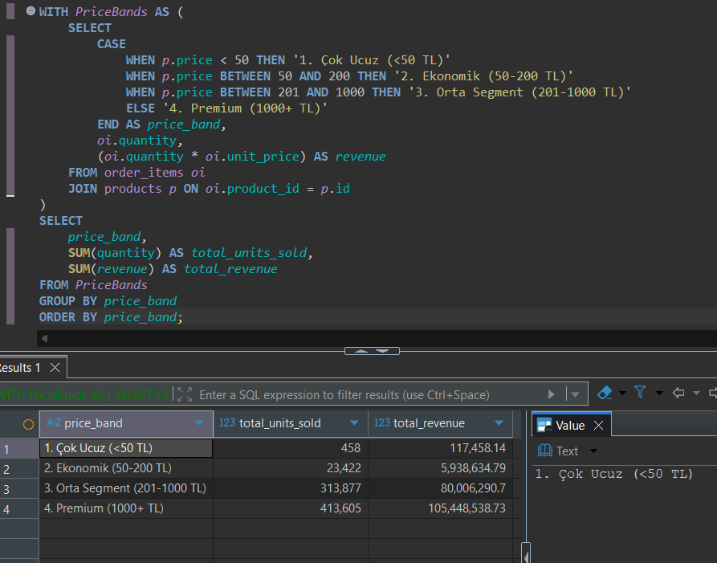

**İş Yorumu:**
Satışların hangi fiyat bandında yığıldığını görmek, tedarik sürecini (purchasing) yönlendirir. Eğer "Ekonomik" segment açık ara öndeyse, platform ağırlıklı olarak fiyat-performans arayan bir kitleye hitap ediyordur. Premium ürün stokları buna göre kısıtlı tutulmalıdır.

---

## Sorgu 25: Kayıt ile İlk Sipariş Arasındaki "İkna Süresi" (Time to First Order)

**İş Sorusu:**
Kullanıcılar platforma kayıt olduktan ne kadar süre sonra (İlk 24 saat, ilk hafta vb.) ilk siparişlerini verip "gerçek müşteriye" dönüşüyorlar?

**SQL Sorgusu:**
```sql
WITH FirstOrderTime AS (
    SELECT 
        u.id, 
        u.created_at AS signup_date, 
        MIN(o.created_at) AS first_order_date
    FROM users u
    JOIN orders o ON u.id = o.user_id
    GROUP BY u.id, u.created_at
)
SELECT 
    CASE 
        WHEN EXTRACT(DAY FROM (first_order_date - signup_date)) = 0 THEN '1. İlk 24 Saat İçinde'
        WHEN EXTRACT(DAY FROM (first_order_date - signup_date)) BETWEEN 1 AND 7 THEN '2. İlk 1 Hafta İçinde'
        WHEN EXTRACT(DAY FROM (first_order_date - signup_date)) BETWEEN 8 AND 30 THEN '3. İlk 1 Ay İçinde'
        ELSE '4. 1 Aydan Sonra'
    END AS time_to_first_order,
    COUNT(id) AS customer_count
FROM FirstOrderTime
GROUP BY 
    CASE 
        WHEN EXTRACT(DAY FROM (first_order_date - signup_date)) = 0 THEN '1. İlk 24 Saat İçinde'
        WHEN EXTRACT(DAY FROM (first_order_date - signup_date)) BETWEEN 1 AND 7 THEN '2. İlk 1 Hafta İçinde'
        WHEN EXTRACT(DAY FROM (first_order_date - signup_date)) BETWEEN 8 AND 30 THEN '3. İlk 1 Ay İçinde'
        ELSE '4. 1 Aydan Sonra'
    END
ORDER BY time_to_first_order;
```

**Sonuç:**
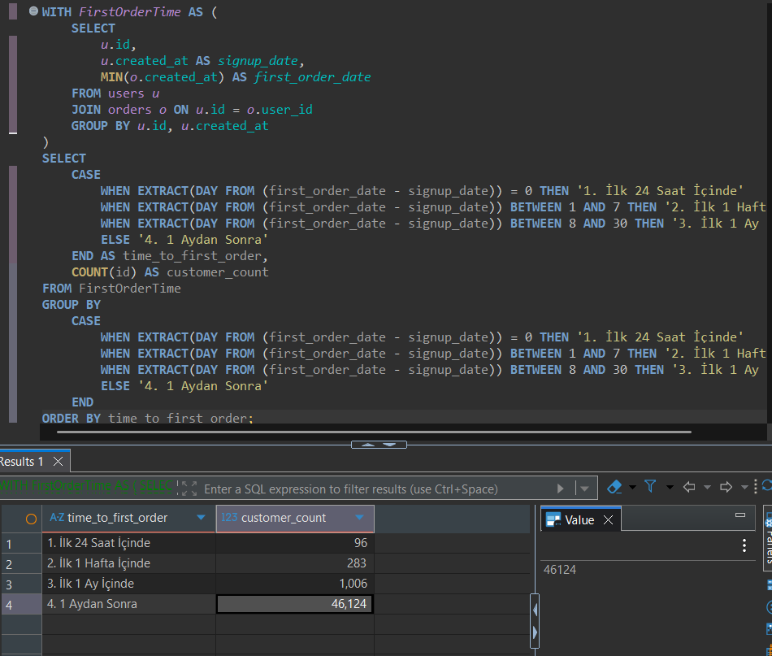

**İş Yorumu:**
Müşterilerin çoğu ilk 24 saat içinde alışveriş yapıyorsa, sisteme duyulan güven tamdır. Ancak "1 Aydan Sonra" kırılımı çok yüksekse, kullanıcılar kayıt olup ürünleri sepetlerine ekliyor ama "Maaş Gününü" bekliyor olabilir. Ay sonlarında sepette unutulan ürünler için hatırlatma (abandoned cart) mailleri artırılmalıdır.

---

## Sorgu 26: Kümülatif (Birikimli) Gelir Büyümesi

**İş Sorusu:**
Platformumuzun kurulduğu günden bu yana elde ettiği toplam gelir, aylık bazda birikimli (kümülatif) olarak nasıl bir büyüme trendi izlemektedir?

**SQL Sorgusu:**
```sql
WITH MonthlyRev AS (
    SELECT 
        DATE_TRUNC('month', o.created_at) AS month, 
        SUM(oi.quantity * oi.unit_price) AS monthly_revenue
    FROM orders o 
    JOIN order_items oi ON o.id = oi.order_id 
    GROUP BY DATE_TRUNC('month', o.created_at)
)
SELECT 
    TO_CHAR(month, 'YYYY-MM') AS month_label, 
    ROUND(monthly_revenue, 2) AS current_month_revenue,
    ROUND(SUM(monthly_revenue) OVER (ORDER BY month), 2) AS cumulative_revenue
FROM MonthlyRev 
ORDER BY month;
```

**Sonuç:**
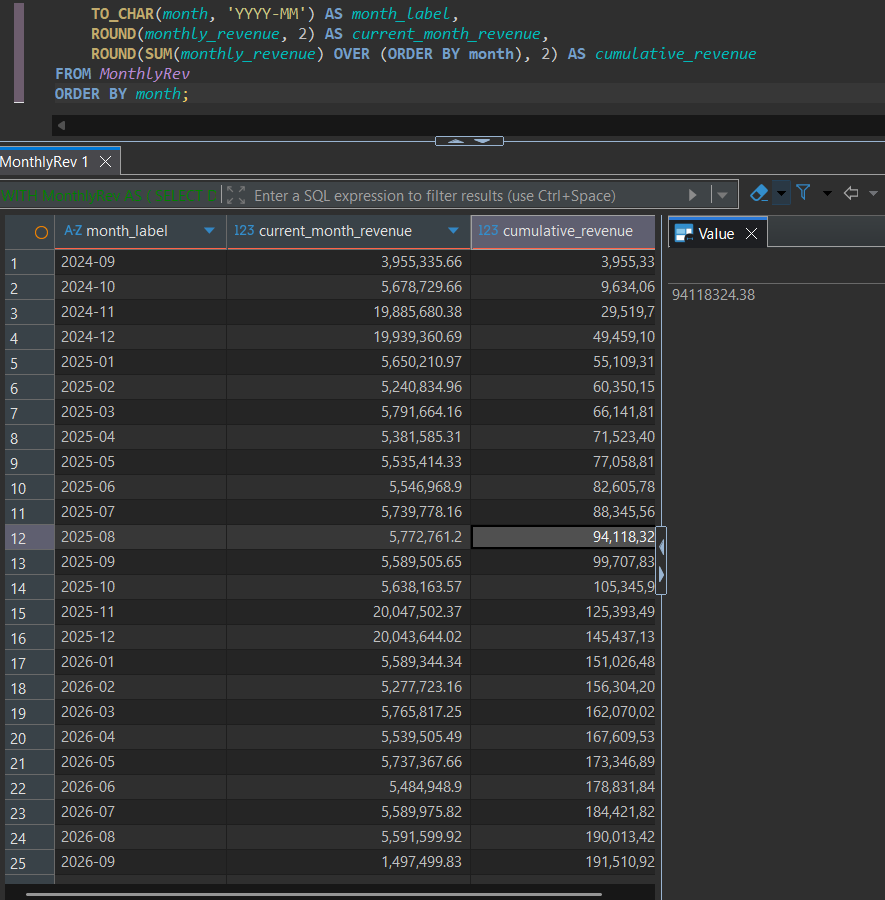

**İş Yorumu:**
Kümülatif gelir grafiği (Running Total), şirketin genel büyüme sağlığını gösteren en kritik "Yukarı ve Sağa" (Up and to the right) grafiğidir. Eğrinin dikleştiği aylar, platformun ivme (momentum) kazandığı, yataylaştığı aylar ise büyümenin durakladığı (stagnation) dönemleri ifade eder.

---

## Sorgu 27: Tekrar Satın Alma Oranı (Repeat Purchase Rate)

**İş Sorusu:**
Platformumuzdan alışveriş yapan müşterilerin yüzde kaçı sadece bir kez sipariş verip bırakıyor, yüzde kaçı ikinci kez gelip "Tekrar Eden Müşteri" statüsüne ulaşıyor?

**SQL Sorgusu:**
```sql
WITH UserOrderCounts AS (
    SELECT 
        user_id, 
        COUNT(id) AS order_count 
    FROM orders 
    GROUP BY user_id
)
SELECT
    COUNT(user_id) AS total_customers,
    SUM(CASE WHEN order_count > 1 THEN 1 ELSE 0 END) AS repeat_customers,
    ROUND((SUM(CASE WHEN order_count > 1 THEN 1 ELSE 0 END)::numeric / COUNT(user_id)) * 100, 2) AS repeat_purchase_rate
FROM UserOrderCounts;
```

**Sonuç:**
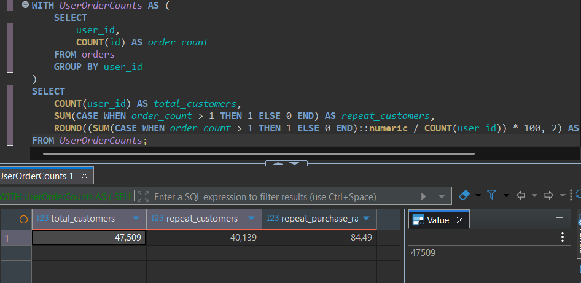

**İş Yorumu:**
Tekrar satın alma oranı (`repeat_purchase_rate`), müşteri memnuniyetinin ve sadakatinin (Loyalty) matematiksel kanıtıdır. E-ticarette bu oranın %20-30 bandının üzerine çıkması, işletmenin yeni müşteri bulmak için harcadığı pazarlama bütçesi (CAC) baskısını inanılmaz derecede hafifletir.

---

## Sorgu 28: Kategori Bazlı Sepet Yoğunluğu

**İş Sorusu:**
Hangi ürün kategorilerinde müşteriler ürünleri "tek tek" almayı tercih ederken, hangi kategorilerde "toplu/çoklu" (bulk) alım yapıyorlar?

**SQL Sorgusu:**
```sql
SELECT 
    c.name AS category_name, 
    ROUND(AVG(oi.quantity), 2) AS avg_quantity_per_order
FROM categories c
JOIN products p ON c.id = p.category_id
JOIN order_items oi ON p.id = oi.product_id
GROUP BY c.name
ORDER BY avg_quantity_per_order DESC;
```

**Sonuç:**
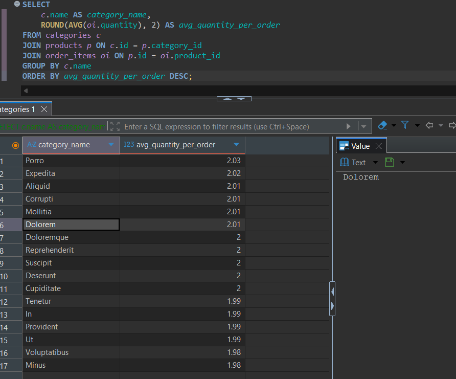

**İş Yorumu:**
Sepet yoğunluğu yüksek olan (aynı anda 3-4 adet alınan) kategoriler, genellikle hızlı tüketim veya temel ihtiyaç ürünleridir. Bu kategorilerde "3 Al 2 Öde" veya "Çoklu Paket (Multipack) İndirimi" gibi stratejiler uygulanarak hacim daha da maksimize edilmelidir.

---

## Sorgu 29: Fiyat Katmanlarına Göre Satış Hızı (Price vs. Volume)

**İş Sorusu:**
Ucuz ürünler mi daha hızlı satılıyor, yoksa pahalı ürünler mi? Fiyat segmentlerine göre "ürün başına düşen ortalama satış adedi" nedir?

**SQL Sorgusu:**
```sql
SELECT 
    CASE 
        WHEN p.price < 100 THEN '1. Ucuz (<100 TL)'
        WHEN p.price BETWEEN 100 AND 500 THEN '2. Orta (100-500 TL)'
        ELSE '3. Pahalı (>500 TL)'
    END AS price_tier,
    COUNT(DISTINCT p.id) AS product_catalog_count,
    SUM(oi.quantity) AS total_units_sold,
    ROUND(SUM(oi.quantity)::numeric / COUNT(DISTINCT p.id), 2) AS avg_sold_per_product
FROM products p
JOIN order_items oi ON p.id = oi.product_id
GROUP BY 
    CASE 
        WHEN p.price < 100 THEN '1. Ucuz (<100 TL)'
        WHEN p.price BETWEEN 100 AND 500 THEN '2. Orta (100-500 TL)'
        ELSE '3. Pahalı (>500 TL)'
    END
ORDER BY price_tier;
```

**Sonuç:**
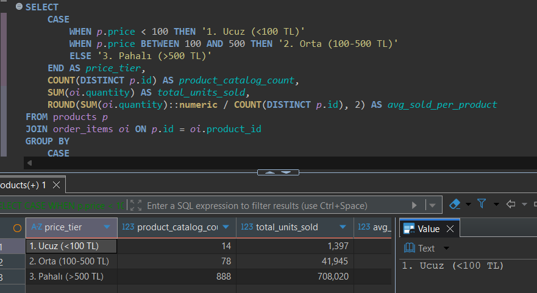

**İş Yorumu:**
Satış hızı (`avg_sold_per_product`), depo raf alanlarının (shelf space) nasıl yönetileceğini belirler. Ucuz ürünlerin satış hızı çok yüksekse, deponun giriş/çıkış kapılarına en yakın lokasyonlarına (Fast-Moving Zone) bu ürünler yerleştirilerek operasyonel hız artırılmalıdır.

---

## Sorgu 30: Aylık Sipariş Durumu (İptal/İade) Trendi

**İş Sorusu:**
Son aylarda platformdaki sipariş iptallerinde veya tamamlanamayan siparişlerde artış var mı? Aylara göre sipariş statülerinin dağılımı nasıldır?

**SQL Sorgusu:**
```sql
SELECT 
    TO_CHAR(DATE_TRUNC('month', created_at), 'YYYY-MM') AS order_month,
    status,
    COUNT(id) AS order_count
FROM orders
GROUP BY DATE_TRUNC('month', created_at), status
ORDER BY order_month DESC, order_count DESC
LIMIT 15;
```

**Sonuç:**
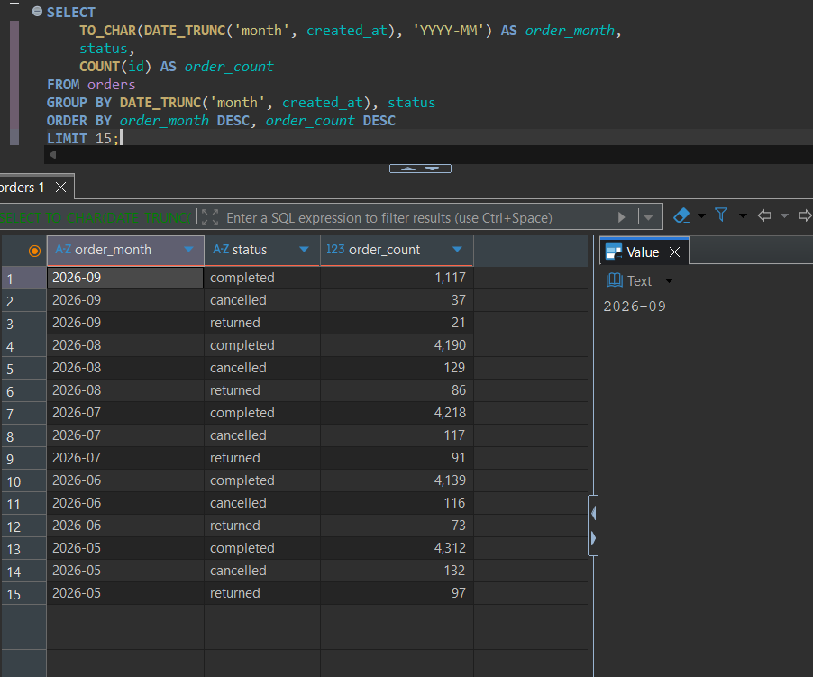

**İş Yorumu:**
Zaman içindeki iptal (cancelled) veya iade oranlarında ani bir sıçrama görülmesi, tedarikçi kalitesinde bozulma, kargo firmasında gecikme veya ödeme altyapısında (Payment Gateway) sistemsel bir hata olduğunun erken uyarı sinyalidir (Early Warning System).

---

## Sorgu 31: Aylık Aktif Kullanıcı Sayısı (MAU - Monthly Active Users)

**İş Sorusu:**
Platformumuzu ziyaret edip sipariş veren (aktif olan) tekil kullanıcı sayısının aylara göre gelişimi nasıldır?

**SQL Sorgusu:**
```sql
SELECT 
    TO_CHAR(DATE_TRUNC('month', created_at), 'YYYY-MM') AS active_month,
    COUNT(DISTINCT user_id) AS monthly_active_users
FROM orders
GROUP BY DATE_TRUNC('month', created_at)
ORDER BY active_month;
```

**Sonuç:**
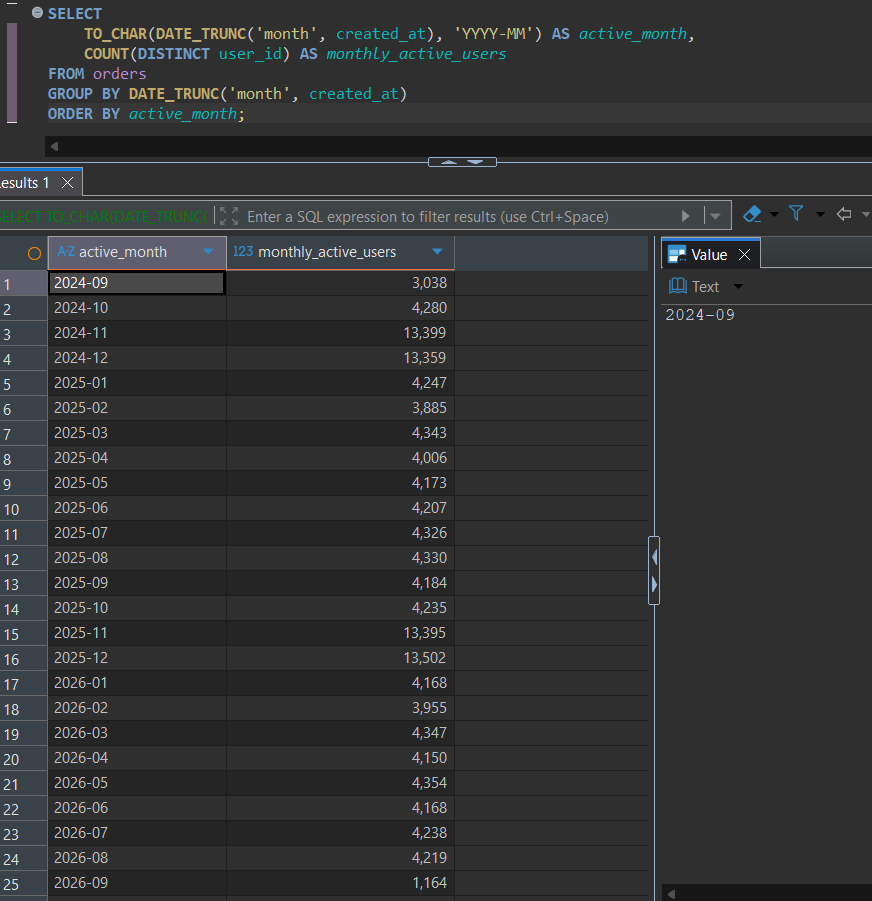

**İş Yorumu:**
Aylık Aktif Kullanıcı (MAU) metriği, bir dijital platformun yaşayıp yaşamadığını gösteren en temel nabız ölçümüdür. Pazarlama kampanyalarının ne kadar trafik yarattığı ve bu trafiğin ne kadarının alışveriş yapan aktif müşteriye dönüştüğü bu metrik üzerinden izlenir.

---

## Sorgu 32: Toptancı (Wholesale) ve Rekor Sipariş Tespiti

**İş Sorusu:**
Platformumuzdan perakende (tekil) alım yapmak yerine, tek bir siparişte çok yüksek adette ürün alarak "toptancı" davranışı sergileyen en büyük 5 işlem hangisidir?

**SQL Sorgusu:**
```sql
SELECT 
    o.id AS order_id,
    u.name AS customer_name,
    SUM(oi.quantity) AS total_items_in_basket,
    SUM(oi.quantity * oi.unit_price) AS total_revenue
FROM orders o
JOIN users u ON o.user_id = u.id
JOIN order_items oi ON o.id = oi.order_id
GROUP BY o.id, u.name
HAVING SUM(oi.quantity) >= 5
ORDER BY total_items_in_basket DESC, total_revenue DESC
LIMIT 5;
```

**Sonuç:**
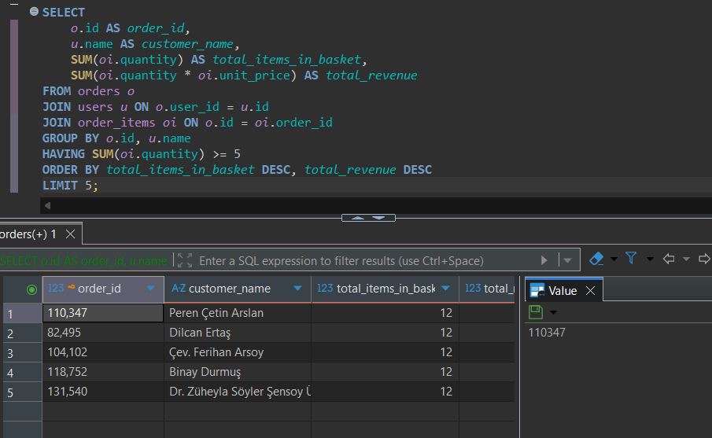

**İş Yorumu:**
Normal şartlarda B2C (tüketiciye yönelik) olan platformlarda bu tarz aşırı yüklü siparişler (Outliers/Aykırı Değerler) ya kurumsal müşterileri ya da fırsatçılığı (örneğin indirimli ürünleri toplayıp başka yerde satanları) işaret eder. Bu kullanıcılar tespit edilip "Kurumsal Satış (B2B)" birimine yönlendirilmelidir.

---

## Sorgu 33: "Ölü Stok" (Dead Stock) ve Yavaş Satan Ürünler Analizi

**İş Sorusu:**
Kataloğumuzda bulunan ancak satış hacmi en düşük olan (depoda tozlanan) ilk 5 ürün hangileridir?

**SQL Sorgusu:**
```sql
SELECT 
    p.name AS product_name, 
    c.name AS category_name,
    COALESCE(SUM(oi.quantity), 0) AS total_units_sold
FROM products p
JOIN categories c ON p.category_id = c.id
LEFT JOIN order_items oi ON p.id = oi.product_id
GROUP BY p.id, p.name, c.name
ORDER BY total_units_sold ASC
LIMIT 5;
```

**Sonuç:**
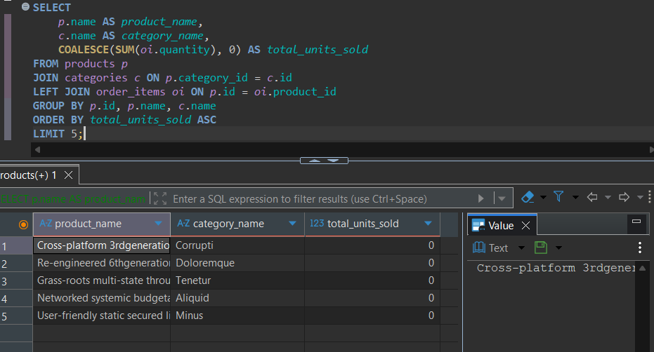

**İş Yorumu:**
Ölü stok (Dead Stock), deponun en büyük düşmanıdır. Hem depolama maliyeti (holding cost) yaratır hem de sermayeyi kilitler. Bu ürünler derhal "Zararına Satış (Clearance)" veya "Sepet Hediyesi" kampanyalarıyla eritilmelidir.

---

## Sorgu 34: Kategorilerin Ortalama Ürün Değeri (Average Item Value)

**İş Sorusu:**
Hangi kategoride satılan ürünler sepete eklendiğinde daha yüksek bir birim fiyat/gelir ortalaması yaratıyor?

**SQL Sorgusu:**
```sql
SELECT 
    c.name AS category_name,
    ROUND(AVG(oi.quantity * oi.unit_price), 2) AS avg_item_revenue
FROM categories c
JOIN products p ON c.id = p.category_id
JOIN order_items oi ON p.id = oi.product_id
GROUP BY c.name
ORDER BY avg_item_revenue DESC;
```

**Sonuç:**
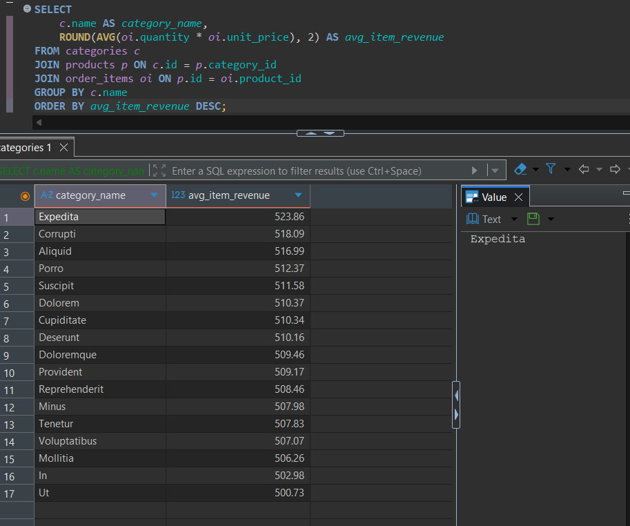

**İş Yorumu:**
Bu sorgu, şirketin "Kategori Karlılığı" haritasını çıkarır. Ortalama sepet değeri çok yüksek olan kategorilere daha premium ve yüksek kaliteli ürün tedariği sağlanırken; ortalaması düşük kategoriler sürümden kazanma (hacim) odaklı yönetilmelidir.

---

## Sorgu 35: Tarihin En Yüksek Satış Yapan 5 Günü (All-Time Highs)

**İş Sorusu:**
Platformumuzun kurulduğu günden bu yana, günlük toplam ciro bazında rekor kırdığımız ilk 5 efsanevi gün hangileridir?

**SQL Sorgusu:**
```sql
SELECT 
    DATE(o.created_at) AS sales_date,
    COUNT(DISTINCT o.id) AS total_orders,
    SUM(oi.quantity * oi.unit_price) AS daily_revenue
FROM orders o
JOIN order_items oi ON o.id = oi.order_id
GROUP BY DATE(o.created_at)
ORDER BY daily_revenue DESC
LIMIT 5;
```

**Sonuç:**
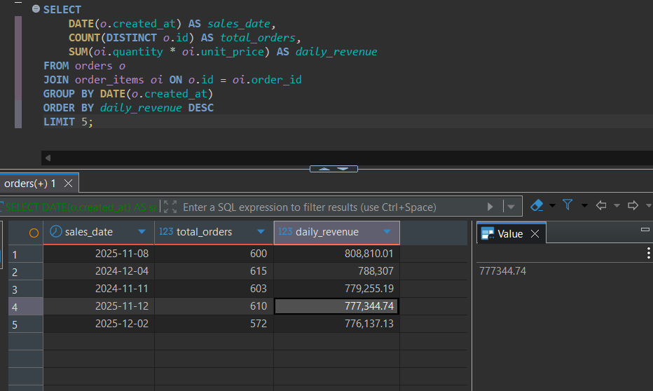

**İş Yorumu:**
En yüksek satış yapılan bu rekor günler (Efsane Cuma, Sevgililer Günü, Yılbaşı Kampanyaları vb.), pazarlama ekibinin gelecek yıl için bütçe planlaması yaparken "kesinlikle reklam bütçesi ayrılması gereken" tarihleri net bir şekilde ortaya koyar.

---

## Sorgu 36: Ortalama Sepet Tutarı (AOV - Average Order Value) Trendi

**İş Sorusu:**
Aylık bazda müşterilerimizin tek bir siparişte bıraktıkları ortalama para miktarı (Sepet Ortalaması) ne yönde ilerlemektedir? 

**SQL Sorgusu:**
```sql
SELECT 
    TO_CHAR(DATE_TRUNC('month', o.created_at), 'YYYY-MM') AS order_month,
    COUNT(DISTINCT o.id) AS total_orders,
    ROUND(SUM(oi.quantity * oi.unit_price) / COUNT(DISTINCT o.id), 2) AS average_order_value
FROM orders o
JOIN order_items oi ON o.id = oi.order_id
GROUP BY DATE_TRUNC('month', o.created_at)
ORDER BY order_month;
```

**Sonuç:**
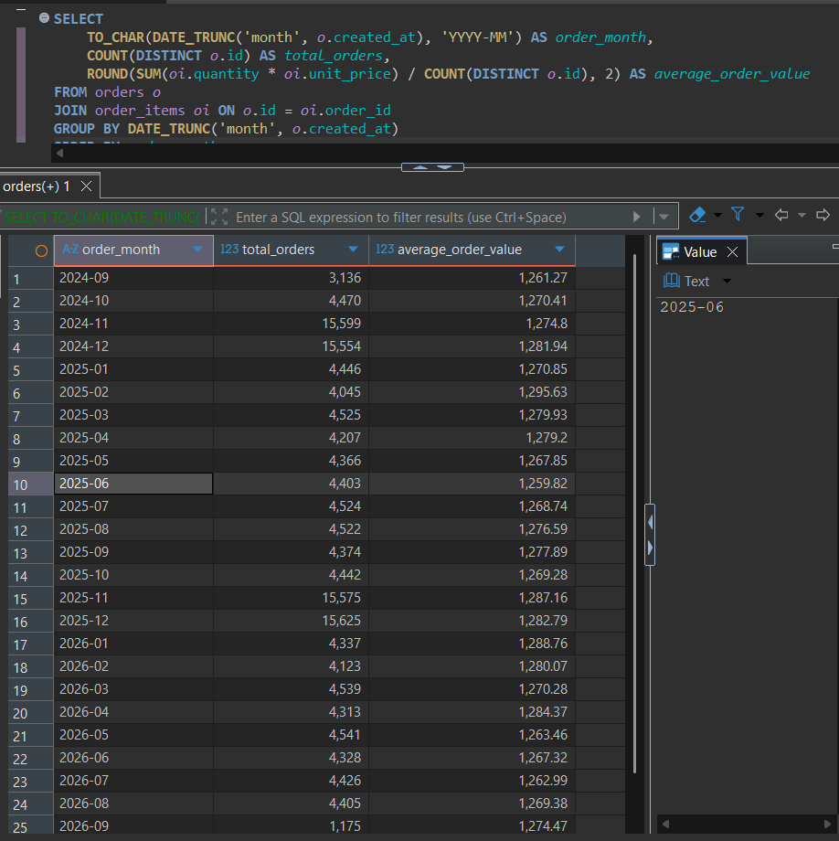

**İş Yorumu:**
Ortalama Sepet Tutarı (AOV), e-ticaretin kutsal kâsesidir. Sipariş sayısı (Trafik) artmasa bile AOV artıyorsa şirket büyüyor demektir. Düşüş trendi olan aylarda acilen "X TL Üzeri Kargo Bedava" barajı yukarı çekilerek müşteriler daha fazla harcamaya teşvik edilmelidir.

---

## Sorgu 37: Kategorilerin Ciro İçindeki Pazar Payı (Market Share)

**İş Sorusu:**
Elde ettiğimiz toplam şirket cirosu içinde, her bir kategorinin yüzde kaçlık bir payı (ağırlığı) bulunmaktadır?

**SQL Sorgusu:**
```sql
WITH CategoryRevenue AS (
    SELECT 
        c.name AS category_name,
        SUM(oi.quantity * oi.unit_price) AS total_revenue
    FROM categories c
    JOIN products p ON c.id = p.category_id
    JOIN order_items oi ON p.id = oi.product_id
    GROUP BY c.name
)
SELECT 
    category_name,
    total_revenue,
    ROUND((total_revenue / SUM(total_revenue) OVER()) * 100, 2) AS revenue_share_percentage
FROM CategoryRevenue
ORDER BY total_revenue DESC;
```

**Sonuç:**
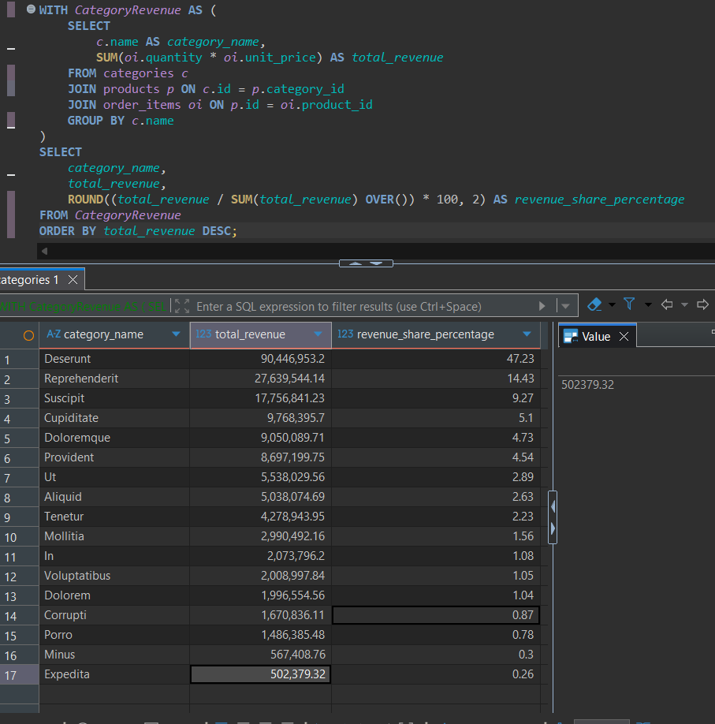

**İş Yorumu:**
Kategorilerin "Pazar Payı", şirketin kime hitap ettiğini tanımlar. Eğer gelirin %70'i sadece 2 kategoriden geliyorsa, şirket büyük bir risk (bağımlılık) altındadır. Zayıf kategorilerin payını artırmak için o alanlara özel çapraz satış (cross-sell) kampanyaları düzenlenmelidir.

---

## Sorgu 38: Müşterilerin Sadakat Süresi (Recency - Son Alışverişten Kalan Gün)

**İş Sorusu:**
Müşterilerimizin son siparişlerinin üzerinden ortalama kaç gün geçti? (Platformu en son ne zaman kullandılar?)

**SQL Sorgusu:**
```sql
WITH LastOrders AS (
    SELECT 
        u.name AS customer_name,
        MAX(o.created_at) AS last_order_date
    FROM users u
    JOIN orders o ON u.id = o.user_id
    GROUP BY u.id, u.name
)
SELECT 
    CASE 
        WHEN EXTRACT(DAY FROM (CURRENT_DATE - last_order_date)) <= 30 THEN '1. Aktif (Son 30 Gün)'
        WHEN EXTRACT(DAY FROM (CURRENT_DATE - last_order_date)) BETWEEN 31 AND 90 THEN '2. Uyuyan (31-90 Gün)'
        ELSE '3. Kaybedilmiş (90+ Gün)'
    END AS customer_status,
    COUNT(customer_name) AS customer_count
FROM LastOrders
GROUP BY 
    CASE 
        WHEN EXTRACT(DAY FROM (CURRENT_DATE - last_order_date)) <= 30 THEN '1. Aktif (Son 30 Gün)'
        WHEN EXTRACT(DAY FROM (CURRENT_DATE - last_order_date)) BETWEEN 31 AND 90 THEN '2. Uyuyan (31-90 Gün)'
        ELSE '3. Kaybedilmiş (90+ Gün)'
    END
ORDER BY customer_status;
```

**Sonuç:**
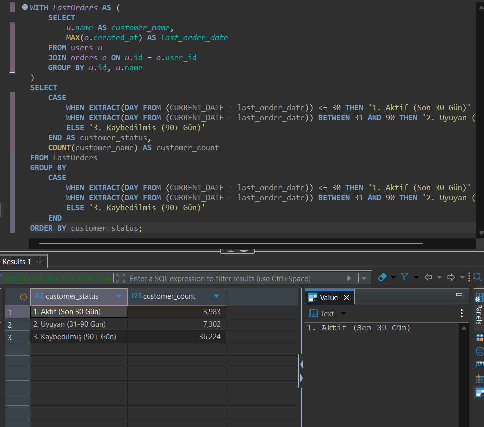

**İş Yorumu:**
"Uyuyan" segmentindeki müşteriler, henüz tamamen kaybedilmemiş ama markayı unutmaya başlamış kitleyi temsil eder. Bu kitleye "Seni Özledik!" başlığıyla özel geri kazanım (win-back) kuponları gönderilerek tekrar "Aktif" segmente çekilmeleri sağlanmalıdır.

---

## Sorgu 39: Günün Bölümlerine (Sabah/Akşam) Göre Satış Dağılımı

**İş Sorusu:**
Sipariş yoğunluğu ve elde edilen gelir, günün 4 ana bölümüne (Sabah, Öğle, Akşam, Gece) göre nasıl bir dağılım göstermektedir?

**SQL Sorgusu:**
```sql
SELECT 
    CASE 
        WHEN EXTRACT(HOUR FROM o.created_at) BETWEEN 6 AND 11 THEN '1. Sabah (06:00-11:59)'
        WHEN EXTRACT(HOUR FROM o.created_at) BETWEEN 12 AND 17 THEN '2. Öğle (12:00-17:59)'
        WHEN EXTRACT(HOUR FROM o.created_at) BETWEEN 18 AND 23 THEN '3. Akşam (18:00-23:59)'
        ELSE '4. Gece (00:00-05:59)'
    END AS time_of_day,
    COUNT(DISTINCT o.id) AS order_count,
    SUM(oi.quantity * oi.unit_price) AS total_revenue
FROM orders o
JOIN order_items oi ON o.id = oi.order_id
GROUP BY 
    CASE 
        WHEN EXTRACT(HOUR FROM o.created_at) BETWEEN 6 AND 11 THEN '1. Sabah (06:00-11:59)'
        WHEN EXTRACT(HOUR FROM o.created_at) BETWEEN 12 AND 17 THEN '2. Öğle (12:00-17:59)'
        WHEN EXTRACT(HOUR FROM o.created_at) BETWEEN 18 AND 23 THEN '3. Akşam (18:00-23:59)'
        ELSE '4. Gece (00:00-05:59)'
    END
ORDER BY time_of_day;
```

**Sonuç:**
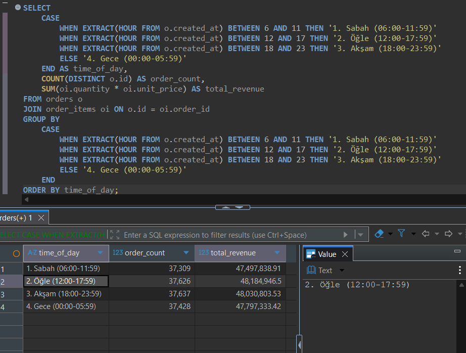

**İş Yorumu:**
Satışların hangi zaman diliminde yoğunlaştığı, canlı destek ekibinin mesai saatlerini ve sunucu bakım (maintenance) pencerelerini belirler. Bakım çalışmaları trafiğin ve siparişin en ölü olduğu zaman diliminde (genellikle gece) yapılmalıdır.

---

## Sorgu 40: Sipariş Başına Ürün Çeşitliliği (Unique Items per Order)

**İş Sorusu:**
Müşteriler sepetlerini doldururken hep aynı ürünün birden fazla kopyasını mı alıyorlar, yoksa farklı farklı ürün çeşitlerini mi kombinliyorlar?

**SQL Sorgusu:**
```sql
WITH OrderDiversity AS (
    SELECT 
        order_id,
        COUNT(DISTINCT product_id) AS unique_products_count
    FROM order_items
    GROUP BY order_id
)
SELECT 
    unique_products_count AS number_of_different_items,
    COUNT(order_id) AS total_orders
FROM OrderDiversity
GROUP BY unique_products_count
ORDER BY number_of_different_items;
```

**Sonuç:**
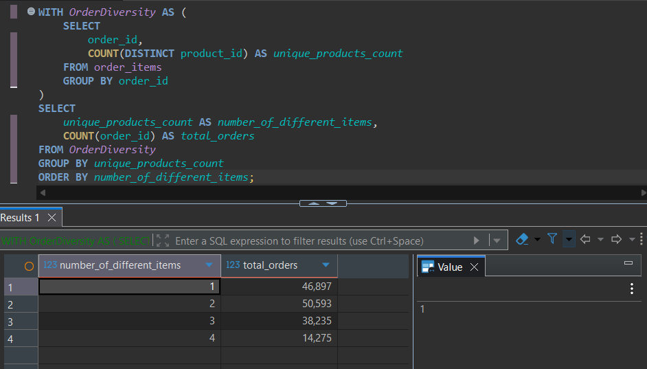

**İş Yorumu:**
Eğer müşteriler genelde sadece 1 çeşit ürün sipariş ediyorsa (farklı çeşitler denemiyorsa), ürün keşif (discovery) arayüzünde problem var demektir. Kullanıcı arayüzünde "Bunu Alanlar Şunları da İnceledi" tarzı tavsiye (recommendation) algoritmaları devreye alınmalıdır.

---

## Sorgu 41: Yeni vs. Mevcut Müşteri Gelir Dağılımı

**İş Sorusu:**
Aylık bazda elde ettiğimiz cironun ne kadarı "Yeni Müşteriler" (o ay ilk kez alışveriş yapanlar), ne kadarı "Mevcut Müşteriler" (daha önce de alışveriş yapmış sadık kitle) tarafından oluşturuluyor?

**SQL Sorgusu:**
```sql
WITH UserFirstOrder AS (
    SELECT user_id, MIN(DATE_TRUNC('month', created_at)) as first_order_month
    FROM orders
    GROUP BY user_id
),
OrderMonths AS (
    SELECT 
        o.id AS order_id,
        o.user_id,
        DATE_TRUNC('month', o.created_at) AS order_month,
        SUM(oi.quantity * oi.unit_price) AS order_revenue
    FROM orders o
    JOIN order_items oi ON o.id = oi.order_id
    GROUP BY o.id, o.user_id, DATE_TRUNC('month', o.created_at)
)
SELECT 
    TO_CHAR(om.order_month, 'YYYY-MM') AS month_label,
    SUM(CASE WHEN om.order_month = ufo.first_order_month THEN om.order_revenue ELSE 0 END) AS new_customer_revenue,
    SUM(CASE WHEN om.order_month > ufo.first_order_month THEN om.order_revenue ELSE 0 END) AS returning_customer_revenue
FROM OrderMonths om
JOIN UserFirstOrder ufo ON om.user_id = ufo.user_id
GROUP BY om.order_month
ORDER BY month_label;
```

**Sonuç:**
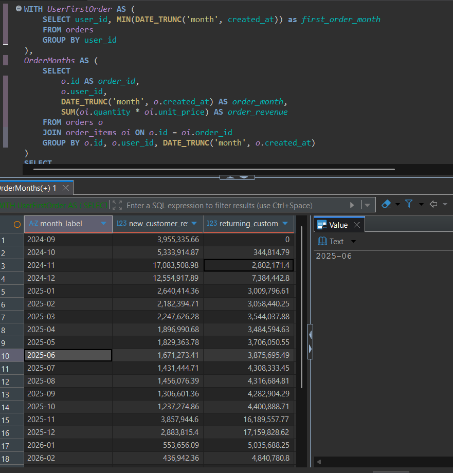

**İş Yorumu:**
Sağlıklı büyüyen bir e-ticaret platformunda, aylar geçtikçe "Mevcut Müşteri" (Returning) gelirinin kartopu gibi büyümesi ve toplam geliri domine etmesi beklenir. Yeni müşteri geliri tamamen reklam harcamalarına (Acquisition) bağlıyken, mevcut müşteri geliri markanın organik gücüdür.

---

## Sorgu 42: Kategorilere Göre İptal/İade Risk Oranları

**İş Sorusu:**
Hangi ürün kategorilerinde verilen siparişler iptal edilmeye veya iade edilmeye (başarısız olmaya) daha yatkındır?

**SQL Sorgusu:**
```sql
SELECT 
    c.name AS category_name,
    COUNT(DISTINCT o.id) AS total_orders,
    SUM(CASE WHEN o.status IN ('cancelled', 'returned') THEN 1 ELSE 0 END) AS failed_orders,
    ROUND((SUM(CASE WHEN o.status IN ('cancelled', 'returned') THEN 1 ELSE 0 END)::numeric / COUNT(DISTINCT o.id)) * 100, 2) AS failure_rate_percentage
FROM categories c
JOIN products p ON c.id = p.category_id
JOIN order_items oi ON p.id = oi.product_id
JOIN orders o ON oi.order_id = o.id
GROUP BY c.name
ORDER BY failure_rate_percentage DESC;
```

**Sonuç:**
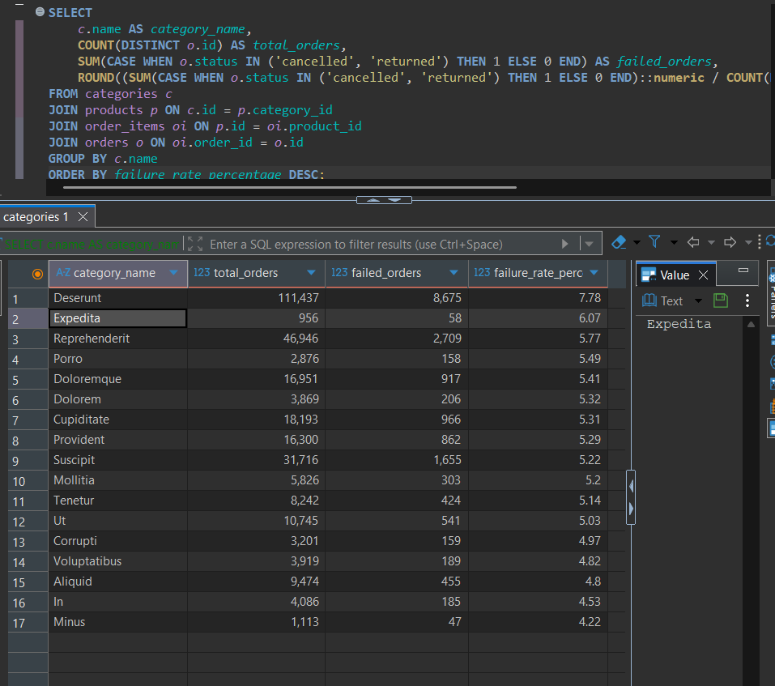

**İş Yorumu:**
İptal/İade oranının (`failure_rate`) belirli bir kategoride tavan yapması; o kategorideki ürünlerin açıklamalarının yanıltıcı olabileceğine, tedarikçide kalite kontrol sorunu olduğuna veya kargolama sırasında ürünlerin hasar gördüğüne (örneğin cam eşyalar) işaret eder.

---

## Sorgu 43: Her Kategorinin En Premium (Pahalı) Ürünü

**İş Sorusu:**
Platformumuzdaki her bir kategorinin vitrinini süsleyen, o kategorideki en yüksek birim fiyata sahip amiral gemisi (flagship) ürün hangisidir?

**SQL Sorgusu:**
```sql
WITH RankedProducts AS (
    SELECT 
        c.name AS category_name,
        p.name AS product_name,
        p.price,
        ROW_NUMBER() OVER(PARTITION BY c.id ORDER BY p.price DESC) as rn
    FROM categories c
    JOIN products p ON c.id = p.category_id
)
SELECT 
    category_name, 
    product_name AS most_expensive_product, 
    price AS maximum_price
FROM RankedProducts
WHERE rn = 1
ORDER BY maximum_price DESC;
```

**Sonuç:**
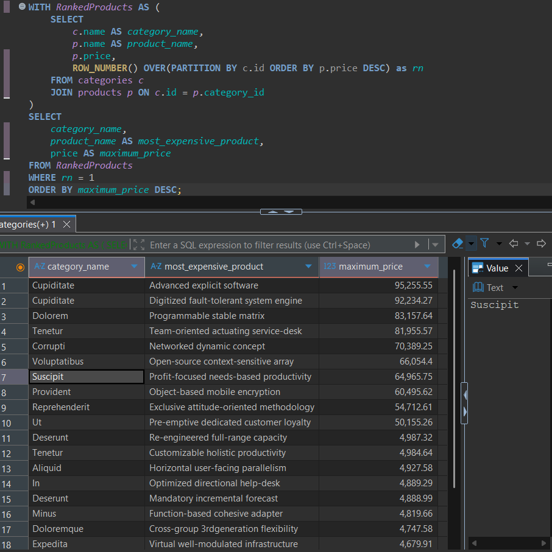

**İş Yorumu:**
Kategorilerin "tavan fiyatını" belirleyen bu amiral gemisi ürünler, markanın algısını (Brand Positioning) lüks segmente taşımak için kullanılır. Fiyat çıpasını (Price Anchoring) yüksek tutarak, diğer orta segment ürünlerin müşteriye daha "uygun fiyatlı" görünmesi sağlanır.

---

## Sorgu 44: Sepetlere Eklenen Ürünlerin Fiyat Segmentasyonu

**İş Sorusu:**
Müşteriler sepetlerini doldururken ağırlıklı olarak ucuz ürünleri mi topluyorlar, yoksa premium ürünleri mi? Sepete eklenen birim eşyaların fiyat dağılımı nasıldır?

**SQL Sorgusu:**
```sql
SELECT 
    CASE 
        WHEN unit_price < 50 THEN '1. Çok Ucuz (<50 TL)'
        WHEN unit_price BETWEEN 50 AND 200 THEN '2. Uygun (50-200 TL)'
        WHEN unit_price BETWEEN 201 AND 1000 THEN '3. Orta (201-1000 TL)'
        ELSE '4. Premium (1000+ TL)'
    END AS item_price_tier,
    COUNT(id) AS times_added_to_cart,
    SUM(quantity) AS total_quantity_purchased
FROM order_items
GROUP BY 
    CASE 
        WHEN unit_price < 50 THEN '1. Çok Ucuz (<50 TL)'
        WHEN unit_price BETWEEN 50 AND 200 THEN '2. Uygun (50-200 TL)'
        WHEN unit_price BETWEEN 201 AND 1000 THEN '3. Orta (201-1000 TL)'
        ELSE '4. Premium (1000+ TL)'
    END
ORDER BY item_price_tier;
```

**Sonuç:**
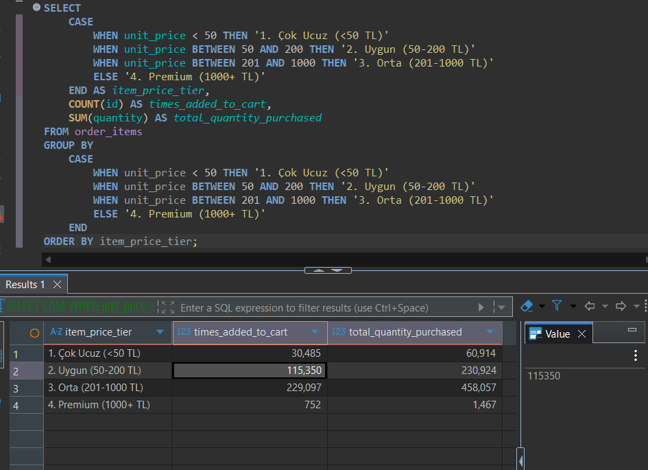

**İş Yorumu:**
Sepete eklenme sıklığı (`times_added_to_cart`), ürünlerin keşfedilebilirliğini gösterir. Müşteriler sepete 50 TL altı ürünleri çok sık atıyorsa, bu ürünler kasa önü fırsatı (upsell) veya kargo barajını geçmek için kullanılan "tamamlayıcı ürünler" olarak harika iş görüyor demektir.

---

## Sorgu 45: Kümülatif Kullanıcı Büyümesi (Running Total)

**İş Sorusu:**
Zaman ekseninde, platformumuza kayıt olan toplam müşteri sayımız gün gün nasıl birikerek artmaktadır?

**SQL Sorgusu:**
```sql
WITH DailySignups AS (
    SELECT 
        DATE(created_at) AS signup_date,
        COUNT(id) AS daily_new_users
    FROM users
    GROUP BY DATE(created_at)
)
SELECT 
    signup_date,
    daily_new_users,
    SUM(daily_new_users) OVER(ORDER BY signup_date) AS cumulative_total_users
FROM DailySignups
ORDER BY signup_date DESC
LIMIT 15;
```

**Sonuç:**
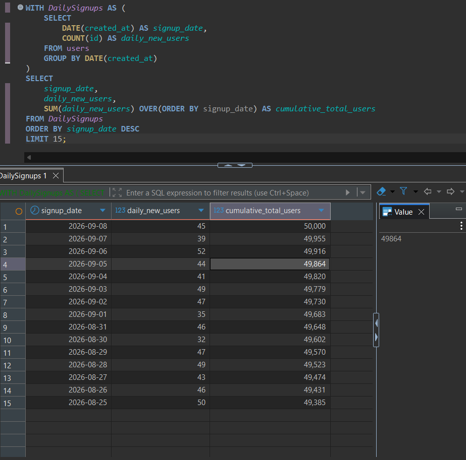

**İş Yorumu:**
Kümülatif kullanıcı grafiği, potansiyel yatırımcılara (Venture Capitalists) sunulan ilk slayttır. Günlük yeni kullanıcı (`daily_new_users`) eklendikçe, toplam kullanıcı tabanının logaritmik veya üstel olarak büyümesi platformun ağ etkisine (Network Effect) ulaştığını gösterir.

---

## Sorgu 46: RFM (Recency, Frequency, Monetary) Analizi Çerçevesi

**İş Sorusu:**
Müşteri değerini ölçen evrensel RFM modeline göre; en son ne zaman alışveriş yaptılar (Recency), kaç kere alışveriş yaptılar (Frequency) ve toplam ne kadar harcadılar (Monetary)?

**SQL Sorgusu:**
```sql
SELECT 
    u.name AS customer_name,
    MAX(o.created_at) AS last_purchase_date,
    COUNT(DISTINCT o.id) AS total_orders_frequency,
    SUM(oi.quantity * oi.unit_price) AS total_spent_monetary
FROM users u
JOIN orders o ON u.id = o.user_id
JOIN order_items oi ON o.id = oi.order_id
GROUP BY u.id, u.name
ORDER BY total_spent_monetary DESC, total_orders_frequency DESC
LIMIT 5;
```

**Sonuç:**
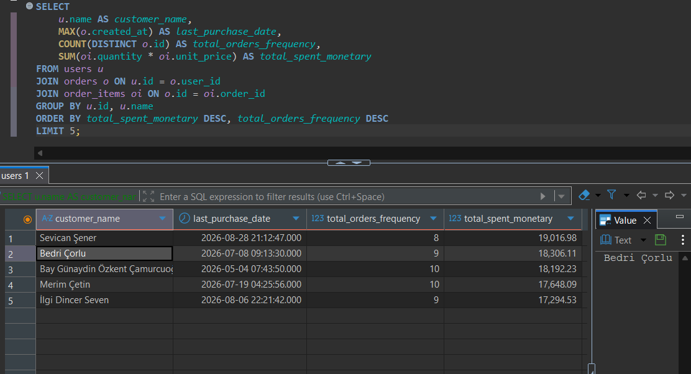

**İş Yorumu:**
Pazarlama stratejilerinin temel taşı olan RFM modeli, müşterileri mikro segmentlere ayırır. Hem sık alışveriş yapan hem de çok para harcayan kitle (Şampiyonlar) sadakat programlarına dahil edilirken; eskiden çok harcayan ama uzun süredir uğramayan kitleye (Risk Altındakiler) agresif geri kazanım kampanyaları düzenlenir.

---

## Sorgu 47: Çoklu Kategori Alıcıları (Cross-Category Shoppers)

**İş Sorusu:**
Platformumuzdaki farklı kategorileri keşfederek, birden fazla ürün kategorisinden alışveriş yapma eğilimi gösteren en çeşitli sepetlere sahip müşteriler kimlerdir?

**SQL Sorgusu:**
```sql
SELECT 
    u.name AS customer_name,
    COUNT(DISTINCT c.id) AS unique_categories_bought,
    SUM(oi.quantity * oi.unit_price) AS total_spent
FROM users u
JOIN orders o ON u.id = o.user_id
JOIN order_items oi ON o.id = oi.order_id
JOIN products p ON oi.product_id = p.id
JOIN categories c ON p.category_id = c.id
GROUP BY u.id, u.name
HAVING COUNT(DISTINCT c.id) > 1
ORDER BY unique_categories_bought DESC, total_spent DESC
LIMIT 5;
```

**Sonuç:**
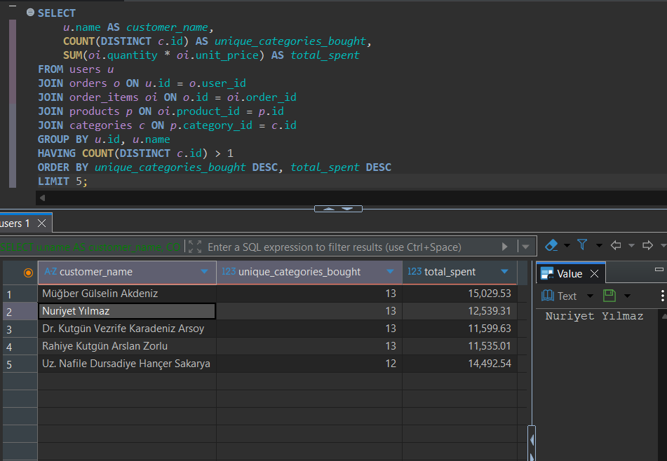

**İş Yorumu:**
Sadece "Elektronik" alan bir müşteri tek boyutludur, ancak hem "Elektronik" hem "Giyim" hem de "Ev Aletleri" alan bir müşteri platformun tam bir "Evangelist"idir (Gönüllü Marka Elçisi). Çapraz kategori alışverişleri, arayüzdeki menü tasarımının (UI/UX) ne kadar başarılı çalıştığını kanıtlar.

---

## Sorgu 48: Zaman İçinde Sipariş İptal Oranı Trendi

**İş Sorusu:**
Aylar geçtikçe platformumuzdaki sipariş iptal edilme (cancellation) oranlarında tehlikeli bir artış veya olumlu bir düşüş trendi var mı?

**SQL Sorgusu:**
```sql
SELECT 
    TO_CHAR(DATE_TRUNC('month', created_at), 'YYYY-MM') AS order_month,
    COUNT(id) AS total_orders,
    SUM(CASE WHEN status = 'cancelled' THEN 1 ELSE 0 END) AS cancelled_orders,
    ROUND((SUM(CASE WHEN status = 'cancelled' THEN 1 ELSE 0 END)::numeric / COUNT(id)) * 100, 2) AS cancellation_rate
FROM orders
GROUP BY DATE_TRUNC('month', created_at)
ORDER BY order_month DESC
LIMIT 5;
```

**Sonuç:**
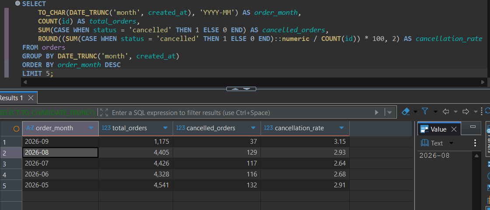

**İş Yorumu:**
İptal oranlarının (`cancellation_rate`) %5'in üzerine çıkması alarm vericidir. Eğer son aylarda bu oranda bir artış varsa, sepetteki gizli kargo ücretleri (Hidden Costs) veya ödeme sayfasındaki karmaşık tasarım (Friction) kullanıcıları son anda kaçırıyor (Cart Abandonment) demektir.

---

## Sorgu 49: Katalog Fiyat Ortalaması vs. Gerçekleşen Satış Hacmi

**İş Sorusu:**
Bir kategorinin katalogdaki (vitrindeki) ortalama fiyatı ile o kategoriden gerçekleşen gerçek satış hacmi arasında nasıl bir ilişki var?

**SQL Sorgusu:**
```sql
SELECT 
    c.name AS category_name,
    ROUND(AVG(p.price), 2) AS avg_catalog_price,
    COALESCE(SUM(oi.quantity), 0) AS total_units_sold,
    ROUND(COALESCE(SUM(oi.quantity * oi.unit_price), 0), 2) AS total_revenue
FROM categories c
JOIN products p ON c.id = p.category_id
LEFT JOIN order_items oi ON p.id = oi.product_id
GROUP BY c.name
ORDER BY total_units_sold DESC;
```

**Sonuç:**
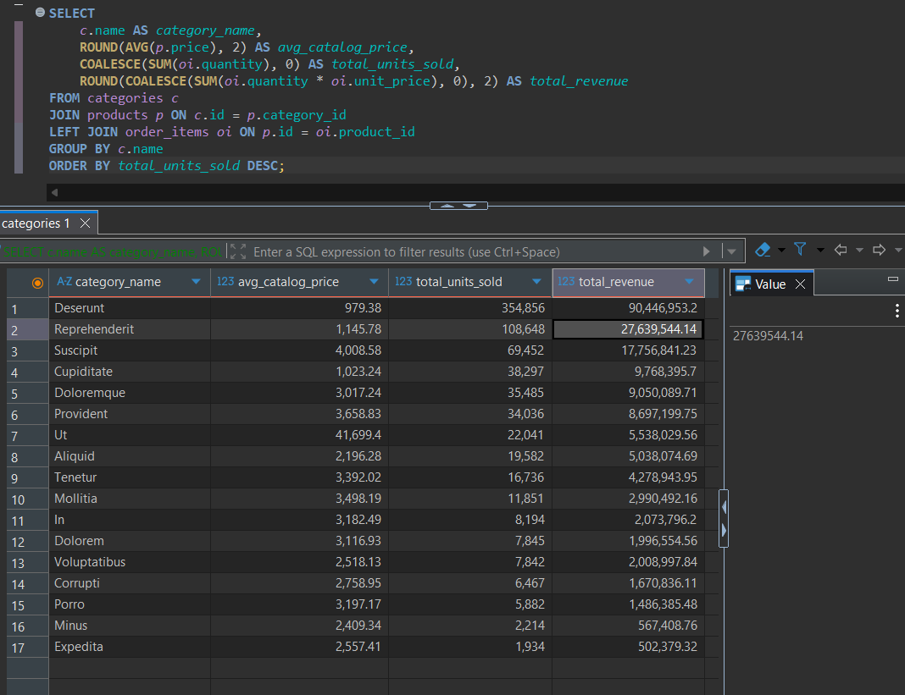

**İş Yorumu:**
Fiyat esnekliği (Price Elasticity) analizi için kullanılır. Ortalama vitrin fiyatı yüksek olan kategorilerin satış hacmi dramatik şekilde düşük kalıyorsa, o kategorilerde psikolojik fiyatlandırma (örn. 500 TL yerine 499 TL) taktikleri uygulanmalı veya ürün karmasına daha ucuz "Giriş Seviyesi" (Entry-Level) ürünler eklenmelidir.

---

## Sorgu 50: Yönetici Özeti Paneli (Executive Summary Dashboard)

**İş Sorusu:**
Yönetim kurulu toplantısında tek bir ekranda şirketin tüm sağlığını göstermek istesek; Toplam Kullanıcı, Toplam Sipariş, Toplam Ciro ve Ortalama Sepet Tutarı (AOV) tek satırda nasıl görünür?

**SQL Sorgusu:**
```sql
SELECT 
    (SELECT COUNT(*) FROM users) AS total_users_all_time,
    (SELECT COUNT(*) FROM orders) AS total_orders_all_time,
    (SELECT ROUND(SUM(quantity * unit_price), 2) FROM order_items) AS lifetime_gross_revenue,
    (SELECT ROUND(SUM(quantity * unit_price) / COUNT(DISTINCT order_id), 2) FROM order_items) AS global_average_order_value;
```

**Sonuç:**
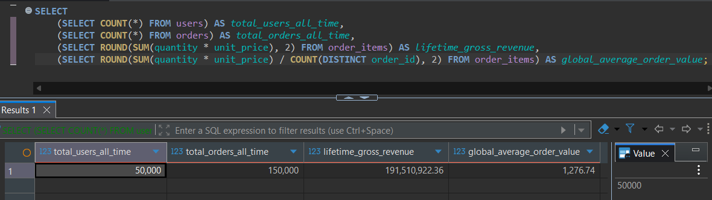

**İş Yorumu:**
Platformun "North Star" (Kuzey Yıldızı) metrikleri tek bir vizörden incelenir. Bu 4 metrik, şirketin piyasa değerlemesini (Valuation) doğrudan belirleyen ana faktörlerdir. Veri analistleri bu sorguyu genellikle her sabah otomatik olarak çalışacak bir e-posta raporuna (Cron Job) bağlar.