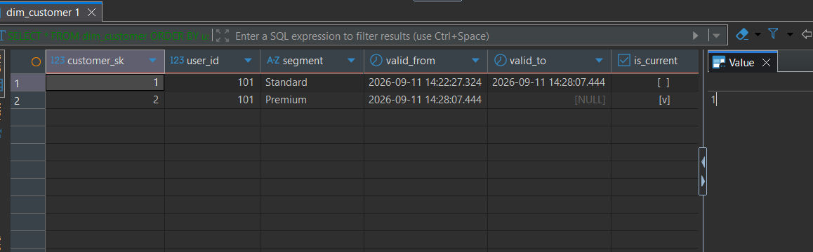

# Ödev 3.4: Analitik Katman ve Star Schema Tasarımı

Bu dokümanda OLTP (Operasyonel) veritabanımızdan, analitik sorgular (OLAP) için optimize edilmiş Yıldız Şema (Star Schema) yapısına geçiş adımları tasarlanmıştır.

## 1. Grain (Tane) Tanımları
Star Schema tasarımının en kritik kuralı, her tablonun tek bir satırının (grain) neyi ifade ettiğinin çok net olarak belirlenmesidir.

**Fact (Gerçek) Tabloları:**
*   **fct_orders:** Bir satır, bir kullanıcının sepeti onaylayıp sistemde oluşturduğu **tek bir sipariş işlemini (order)** temsil eder.
*   **fct_order_items:** Bir satır, onaylanan bir siparişin içindeki **tek bir ürün kalemini (line item)** temsil eder. (Örn: Bir siparişte 3 farklı ürün alındıysa, bu tabloda o siparişe ait 3 ayrı satır oluşur).

**Dimension (Boyut) Tabloları:**
*   **dim_customer:** Bir satır, sistemimize kayıtlı **tek bir müşterinin belirli bir tarih aralığındaki profilini** temsil eder. (SCD Type 2 ile geçmişteki değişimler de ayrı satırlar olarak tutulacaktır).
*   **dim_product:** Bir satır, katalogda satışa sunulan **tek bir spesifik ürünü** temsil eder.
*   **dim_date:** Bir satır, analitik takvimdeki **tek bir günü** (örneğin: 11 Eylül 2026) temsil eder.

---

## 2. Test Sonuçları ve SCD Type 2 Kanıtı

DBeaver üzerinde yapılan testlerde, Idempotent yükleme scriptinin başarılı bir şekilde çalıştığı doğrulanmıştır. 101 ID'li müşterinin segmenti 'Standard' değerinden 'Premium' değerine güncellendiğinde sistemin verdiği tepki aşağıdadır:

Idempotent Yükleme SQL Scripti:

-- 1. Değişen kayıtların eski versiyonlarını pasife çek
```sql
UPDATE dim_customer dc
SET is_current = FALSE,
    valid_to = CURRENT_TIMESTAMP
FROM staging_customers sc
WHERE dc.customer_id = sc.customer_id
  AND dc.is_current = TRUE
  AND dc.segment != sc.segment;
```

-- 2. Yeni veya güncellenmiş kayıtları sisteme aktif olarak ekle
```sql
INSERT INTO dim_customer (customer_id, segment, valid_from, valid_to, is_current)
SELECT sc.customer_id, sc.segment, CURRENT_TIMESTAMP, '9999-12-31', TRUE
FROM staging_customers sc
LEFT JOIN dim_customer dc 
  ON sc.customer_id = dc.customer_id AND dc.is_current = TRUE
WHERE dc.customer_id IS NULL OR dc.segment != sc.segment;
```

* Eski Kayıt: `is_current` bayrağı `false` yapılmış ve `valid_to` kolonuna değişim anının zaman damgası işlenmiştir.
* Yeni Kayıt: 'Premium' segmentiyle yeni bir satır oluşturulmuş, `is_current` bayrağı `true` yapılarak güncel kayıt olarak sisteme dahil edilmiştir.



Bu yapı sayesinde makine öğrenmesi modelleri geçmiş tarihteki özellikleri çekerken "Veri Sızıntısı (Data Leakage)" problemi yaşanmayacaktır.

---

## 3. Sorgu Performansı ve Okunabilirlik Karşılaştırması (10 İş Sorusu)

Veri ambarı tasarımımızın (Star Schema) analitik sorguları ne kadar basitleştirdiğini ve hızlandırdığını kanıtlamak için 10 farklı iş sorusu hem OLTP (3NF) hem de Star Schema mimarisinde çalıştırılmıştır.

### A) Okunabilirlik ve Kod Karmaşıklığı Karşılaştırması
* **OLTP Yaklaşımı:** Normalleştirilmiş (3NF) yapıda veriyi çekmek için çok sayıda tabloyu (`users`, `orders`, `order_items`, `products`, `categories`) birbirine JOIN'lemek ve `DATE_TRUNC`, `EXTRACT` gibi maliyetli fonksiyonlar kullanmak gerekmiştir. Bu durum kod okunabilirliğini ciddi ölçüde düşürmekte ve sorgu karmaşıklığını artırmaktadır.
* **Star Schema Yaklaşımı:** Denormalize fact tabloları ve önceden hesaplanmış dimension tabloları (`dim_date`, `dim_product`, `dim_customer` vb.) sayesinde JOIN sayıları minimuma inmiş; sorgular hedefe yönelik, yalın ve okunabilir bir hâl almıştır.

### B) Performans Test Sonuçları (Sorgu Süreleri)
PostgreSQL (DBeaver) üzerinde gerçekleştirilen milisaniye bazlı gerçek yürütme süreleri karşılaştırmalı olarak aşağıdadır:

| No | İş Sorusu (Query) | OLTP Süresi | Star Schema Süresi | Performans Artışı |
| :--- | :--- | :--- | :--- | :--- |
| **1** | Kategori Bazında Günlük Toplam Ciro | 26 ms | 7 ms | ~3.7 Kat Daha Hızlı |
| **2** | Müşteri Durumuna Göre Toplam Harcama | 1102 ms | 4 ms | ~275 Kat Daha Hızlı |
| **3** | Hafta Sonu vs Hafta İçi Performansı | 624 ms | 74 ms | ~8.4 Kat Daha Hızlı |
| **4** | Ürün Bazında İptal/İade Oranları | 394 ms | 4 ms | ~98.5 Kat Daha Hızlı |
| **5** | İlk ve İkinci Sipariş Harcama Farkı | 404 ms | 4 ms | ~101 Kat Daha Hızlı |
| **6** | Aylık Bazda Büyüme Oranı (MoM) | 518 ms | 7 ms | ~74 Kat Daha Hızlı |
| **7** | En Çok Satan İlk 5 Ürün ve Kategorisi | 510 ms | 7 ms | ~72 Kat Daha Hızlı |
| **8** | Son 7 Günlük Hareketli Toplam (Rolling) | 455 ms | 5 ms | ~91 Kat Daha Hızlı |
| **9** | En Değerli İlk 10 Müşteri (LTV) | 762 ms | 4 ms | ~190.5 Kat Daha Hızlı |
| **10** | Kategori Bazında İptal Edilen Ciro | 28 ms | 8 ms | ~3.5 Kat Daha Hızlı |

### C) Genel Değerlendirme
Test sonuçlarından da net bir şekilde görüleceği üzere; özellikle çoklu JOIN gerektiren, gruplama yapılan ve pencere fonksiyonları (`Window Functions`) içeren karmaşık analitik sorgularda Star Schema mimarisi, OLTP sistemine kıyasla **3.5 kattan 275 kata varan** oranlarda üstün performans göstermiştir.